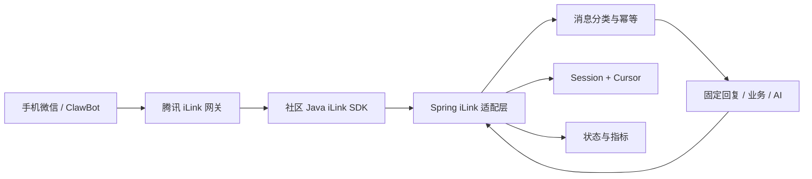

# 微信 iLink Java 项目 AI 复刻任务书

> 基线日期：2026-07-16  
> 目标读者：接手项目的 AI 编程助手、Java 开发人员、验收人员  
> 基线工程：Spring Boot 4.1.0、Java 21、Maven、`weixin-ilink-sdk:1.0.0`

## 1. 文档用途

把本文件连同待开发的 Spring Boot 工程一起交给另一个 AI，要求它严格按照本文分阶段实现、测试和交付。

本文既可以用于：

- 从空白 Spring Boot 项目复刻微信 iLink 文本机器人；
- 在已有 Spring Boot 项目中新增独立的 iLink 模块；
- 审查一个现有 iLink Java Demo 是否达到本项目标准；
- 继续扩展语音、图片、AI 回复和生产部署能力。

本文的 MVP 是：

1. Java 应用通过腾讯 iLink 网关连接微信 ClawBot；
2. 首次启动生成二维码，用户使用微信扫码授权；
3. 长轮询接收用户消息；
4. 识别 TEXT、VOICE、IMAGE、FILE、VIDEO；
5. 对新收到的文字消息回复固定中文；
6. 保存登录 Session 和消息 Cursor，重启后无需重复扫码；
7. 提供本地状态和二维码接口；
8. 避免旧消息无限重放、重复回复和中文乱码。

## 2. 重要事实和边界

### 2.1 官方与社区实现的区别

- 腾讯公开维护的参考实现是 TypeScript/OpenClaw 插件：`@tencent-weixin/openclaw-weixin`。
- 当前 Java 工程使用 Maven Central 上的社区 SDK：

```text
io.github.morningwn:weixin-ilink-sdk:1.0.0
```

- 这个 Java SDK 不是腾讯官方 Java SDK。
- Java SDK 可以连接腾讯 iLink 官方后端，但其维护、兼容性和发布节奏由社区作者负责。
- 生产使用前必须锁定版本、审计 SDK 源码，并持续跟踪腾讯官方插件的协议变化。

### 2.2 iLink 不是一个永久 Webhook

iLink 的工作方式是：

```text
二维码登录
→ 腾讯返回 Session/Token/Bot ID/User ID/Base URL
→ Java 持续调用 getupdates 长轮询
→ 收到消息后携带 context_token 调用 sendmessage
```

它不是 WebSocket，也不是把一个固定 ID 填到 Java 中就能永久收发消息。

### 2.3 当前 MVP 的媒体边界

- TEXT：已经接收并固定回复。
- VOICE：识别类型，并可读取微信提供的 `voiceItem.text()` 转写字段；MVP 不解码原始语音。
- IMAGE：识别类型；MVP 不下载、不解密、不做视觉识别。
- FILE/VIDEO：识别类型并记录日志；MVP 不处理内容。

不要在验收报告中把“识别出 IMAGE/VOICE 类型”写成“已经完成图片/语音内容处理”。

## 3. 前置准备

### 3.1 开发环境

| 项目 | 要求 |
|---|---|
| JDK | Java 21 推荐；SDK 最低要求 Java 17 |
| Maven | Maven 3.9+ |
| Spring Boot | 当前基线 4.1.0 |
| IDE | IntelliJ IDEA，可选 |
| 网络 | 能访问 Maven 仓库和腾讯 iLink/CDN 域名 |
| 端口 | 默认 8080；冲突时可使用 8081 |

检查命令：

```powershell
java -version
mvn -version
```

### 3.2 微信侧准备

- 一个能够使用微信 ClawBot/iLink 授权流程的微信账号；
- 手机微信可以扫描腾讯返回的二维码；
- 首次联调时应用保持运行；
- 不承诺账号零风险，上线前必须阅读并遵守微信相关功能条款。

### 3.3 交给 AI 的输入

至少提供：

- 工程根目录；
- 当前 `pom.xml`；
- Spring Boot 主类；
- 当前 Git 状态和未提交修改说明；
- 本文档；
- 是否允许真实扫码联调；
- 计划使用的端口；
- 是否只做 MVP，还是继续做媒体/AI。

绝对不要提供或粘贴真实的 iLink Token、Session 文件内容或二维码授权凭证。

## 4. 推荐架构



核心原则：

- SDK 对象只能出现在 iLink 适配层；
- Controller 和未来的业务/AI 代码不直接操作 Token；
- Session、Cursor、消息幂等是三类不同状态；
- 登录失败、连接失败和单条消息发送失败必须区分；
- 自动化测试默认不得连接真实微信。

## 5. 目录和文件规范

推荐放在独立包中，避免覆盖项目已有业务代码：

```text
src/main/java/com/example/ykdsummer/bot
├── config
│   └── ILinkProperties.java
├── controller
│   └── ILinkController.java
├── message
│   ├── ILinkMessageType.java
│   └── RecentMessageIds.java
├── runtime
│   └── ILinkRuntimeState.java
├── service
│   └── ILinkBotService.java
└── session
    └── ILinkSessionStore.java

src/test/java/com/example/ykdsummer/bot
├── ILinkApplicationContextTest.java
├── message
│   ├── ILinkMessageTypeTest.java
│   └── RecentMessageIdsTest.java
└── session
    └── ILinkSessionStoreTest.java
```

如果目标工程包名不同，只替换 `com.example.ykdsummer`，不要改变职责划分。

## 6. Maven 依赖

在 `pom.xml` 中加入：

```xml
<dependency>
    <groupId>io.github.morningwn</groupId>
    <artifactId>weixin-ilink-sdk</artifactId>
    <version>1.0.0</version>
</dependency>
```

测试依赖：

```xml
<dependency>
    <groupId>org.springframework.boot</groupId>
    <artifactId>spring-boot-starter-test</artifactId>
    <scope>test</scope>
</dependency>
```

SDK 版本必须显式固定，不能使用 `LATEST`、动态版本或未审查的快照版本。

验证依赖：

```powershell
mvn dependency:tree
mvn -DskipTests compile
```

## 7. 配置规范

`src/main/resources/application.properties`：

```properties
spring.application.name=ykd-summer

# 默认关闭，避免单元测试或普通启动连接真实微信。
ilink.enabled=${ILINK_ENABLED:false}
ilink.base-url=https://ilinkai.weixin.qq.com
ilink.channel-version=1.0.0

# .properties 使用传统 ISO-8859-1 语义，中文默认值必须使用 Unicode 转义。
ilink.fixed-reply=${ILINK_FIXED_REPLY:\u4F60\u597D\uFF0C\u6211\u5DF2\u7ECF\u6536\u5230\u4F60\u7684\u6587\u672C\u6D88\u606F\u3002}

ilink.session-file=${ILINK_SESSION_FILE:.ilink/session.properties}
```

运行时中文内容是：

```text
你好，我已经收到你的文本消息。
```

### 7.1 为什么不能直接写中文默认值

在本项目实际联调中，直接写中文导致微信收到：

```text
你好，我...
```

这是 UTF-8 字节被按 ISO-8859-1 解释产生的乱码。必须保留 Unicode 转义，并用 Spring 配置绑定测试防止回归。

### 7.2 Git 忽略规则

`.gitignore` 必须包含：

```gitignore
.ilink/
```

Session 文件包含 Token，不得提交、截图、打印或放进 AI 对话。

## 8. 各类的实现职责

### 8.1 `ILinkProperties`

要求：

- `@Component`；
- `@ConfigurationProperties(prefix = "ilink")`；
- 字段：`enabled`、`baseUrl`、`channelVersion`、`fixedReply`、`sessionFile`；
- 使用 `Path` 表示 Session 文件路径；
- 保留安全默认值：`enabled=false`。

### 8.2 `ILinkRuntimeState`

负责保存可以安全暴露到本地状态接口的信息：

- `connectionStatus`；
- `qrCodeUrl`；
- `accountId`；
- 收到/发送消息计数；
- 最后消息类型与时间；
- 最后错误摘要。

并发要求：

- 字符串/时间状态可以使用 `volatile`；
- 计数使用 `AtomicLong`；
- 状态接口返回不可变 `record Snapshot`；
- 不得在 Snapshot 中返回 Token、User ID、Cursor 或 Session 文件内容。

建议状态：

```text
DISABLED
STARTING
WAITING_FOR_QR_SCAN
CONNECTED
ERROR
```

单条消息发送失败只更新 `lastError`，不能把整个连接直接改成 `ERROR`；连接初始化或 Session 存储失败才设置连接错误。

### 8.3 `ILinkSessionStore`

实现 SDK 的 `SessionHandler`，职责：

1. `loadSession()`：从本地恢复 Token、Base URL、Account ID、User ID、Cursor；
2. `persistSession()`：扫码成功后保存 Session；
3. `clearSession()`：Session 过期时删除本地文件；
4. `onQrcode()`：把二维码 URL 写入运行状态；
5. `confirmGetUpdatesBuf()`：仅在批次完整处理后提交新 Cursor。

Session 文件结构只能使用占位示例：

```properties
token=<secret>
baseUrl=<tencent-returned-base-url>
accountId=<bot-account-id>
userId=<wechat-user-id>
cursor=<get-updates-buffer>
```

文件写入规范：

- 使用 UTF-8 Reader/Writer；
- 先写临时文件，再原子替换目标文件；
- 原子移动不支持时退化为覆盖移动；
- Linux/macOS 尝试设置 `rw-------`；
- Windows 不能依赖 POSIX 权限，生产环境必须用操作系统密钥保护、KMS 或 Vault；
- 任何日志都不能包含 Token 和 Cursor。

### 8.4 `ILinkMessageType`

将 SDK 数字常量映射为应用枚举：

| SDK 类型 | 应用类型 |
|---|---|
| `ITEM_TYPE_TEXT` | `TEXT` |
| `ITEM_TYPE_IMAGE` | `IMAGE` |
| `ITEM_TYPE_VOICE` | `VOICE` |
| `ITEM_TYPE_FILE` | `FILE` |
| `ITEM_TYPE_VIDEO` | `VIDEO` |
| 空值/未来类型 | `UNKNOWN` |

禁止在业务代码中到处散落数字 `1/2/3/4/5`。

### 8.5 `RecentMessageIds`

MVP 使用线程安全的有界内存窗口：

- 构造参数必须大于 0；
- 使用 `LinkedHashMap` 维护最近访问顺序；
- 达到上限后淘汰最旧 ID；
- `contains` 和 `remember` 需要同步；
- `null` ID 不写入。

生产环境应替换为 Redis 幂等键，并设置合理 TTL。

### 8.6 `ILinkBotService`

这是核心生命周期和消息处理类。

#### 启动

```text
@PostConstruct
→ 如果 ilink.enabled=false，设置 DISABLED 后返回
→ 构造 ILinkClientConfig
→ 创建 ILinkBot
→ 恢复 Cursor
→ startAutoPull(handler)
```

关键 API：

```java
ILinkClientConfig.builder()
        .baseUrl(settings.getBaseUrl())
        .channelVersion(settings.getChannelVersion())
        .build();

ILinkBot bot = new ILinkBot(config, "application-name", sessionStore);
bot.setGetUpdatesBuf(sessionStore.loadCursor());
bot.startAutoPull(this::handleInboundMessage);
```

#### 关闭

使用 `@PreDestroy` 调用 `ILinkBot.close()`，让长轮询和线程池正常停止。

#### 入站消息处理顺序

必须按照以下顺序：

1. 丢弃空消息；
2. 只处理 `MESSAGE_TYPE_USER`，避免机器人消息触发自己；
3. 对 `itemList` 做空集合保护；
4. 分类并更新运行状态；
5. VOICE 只记录可选转写字段；其他媒体只记录类型；
6. 找到第一个非空 TEXT；
7. 检查最近消息 ID，跳过重复；
8. 跳过应用启动前已经过旧的积压文本，但允许游标继续提交；
9. 使用入站消息调用 `replyText`；
10. 成功后记住消息 ID并增加发送计数；
11. 失败时记住消息 ID、记录错误，但不要向 SDK 批处理层继续抛出。

#### 必须保留的旧消息保护

实际联调发现：如果消息处理器抛异常，SDK 会判定批次未完整处理并延迟 Cursor 提交，然后再次投递同一批消息。

必须同时采取：

- 启动时间保护：例如跳过启动时间两分钟前的文本回复；
- 单条回复失败不冒泡：记录告警并返回，让批次 Cursor 可以前进；
- 消息 ID 内存去重：降低同进程内立即重复回复。

不要简单地在 `catch` 中再次 `throw exception`。

#### 回复规则

回复入站消息优先使用：

```java
bot.replyText(inboundMessage, replyText);
```

SDK 会使用原消息中的：

- `fromUserId`；
- `contextToken`。

主动发送需要：

```java
bot.sendText(toUserId, contextToken, text);
```

`contextToken` 不是永久令牌，不能无限期缓存后用于任意主动推送。

### 8.7 `ILinkController`

MVP 本地接口：

| 方法 | 路径 | 用途 |
|---|---|---|
| GET | `/api/ilink/status` | 查看启用、轮询、连接、计数和错误状态 |
| GET | `/api/ilink/qrcode` | 有待扫描二维码时 302 跳转；没有时返回 404 JSON |
| POST | `/api/ilink/send` | 使用 `toUserId + contextToken + text` 手动测试文本发送 |

`qrcode` 在已经连接后返回 404 是正常现象，不代表登录丢失。二维码只用于待授权阶段。

生产环境不能把这些接口无认证地暴露到公网。

## 9. AI 执行规范

接手 AI 必须遵守：

1. 先扫描工程、读取 `pom.xml`、主类、配置和 Git 状态；
2. 保留用户已有的未提交修改，不覆盖无关文件；
3. iLink 新代码放入独立包；
4. 每次修改前先说明这一步解决什么问题；
5. 优先使用小范围补丁，不整文件覆盖用户代码；
6. 自动化测试默认 `ilink.enabled=false`，禁止测试过程连接真实微信；
7. 真实扫码前明确告诉用户会发生什么；
8. 不输出 Session、Token、Cursor、完整 Context Token；
9. 不删除 `.ilink/session.properties`，除非用户明确要求重新登录；
10. 不启动两个 Spring 进程争抢同一个端口；
11. 修改后至少执行编译、测试、打包；
12. 真实联调必须检查收发计数和是否存在重复循环；
13. 最终报告区分“自动测试通过”和“真实微信联调通过”。

## 10. 测试规范

当前基线应至少有以下 8 个测试：

### 10.1 Spring 上下文测试（2 个）

- `ilink.enabled=false` 时不连接微信；
- 中文固定回复绑定后等于正常中文，防止 `ä½...` 乱码回归。

### 10.2 消息类型测试（2 个）

- 已知 5 种 SDK 类型映射正确；
- `null` 和未来类型映射为 `UNKNOWN`。

### 10.3 最近消息 ID 测试（1 个）

- 能记住 ID，并在超过上限时淘汰最旧 ID。

### 10.4 Session/Cursor 测试（3 个）

- Session 和 Cursor 可以写入并重新加载；
- 批次处理失败时不提交新 Cursor；
- Session 过期清理本地文件。

建议后续补充：

- 旧消息不回复但允许批次完成；
- 单条发送异常不向长轮询层抛出；
- BOT 类型消息不触发回复；
- TEXT 空内容不触发发送；
- 状态接口不泄露敏感字段。

运行：

```powershell
mvn test
mvn package
```

合格结果必须是：

```text
BUILD SUCCESS
Tests run: 8, Failures: 0, Errors: 0
```

如果后续增加测试，数量可以大于 8，但不能少于上述覆盖范围。

## 11. 启动方式

### 11.1 IntelliJ IDEA

在 Spring Boot 运行配置的 `Program arguments` 中加入：

```text
--ilink.enabled=true
```

然后只运行一次 `YkdSummerApplication`。

不要同时在 IDEA 和 PowerShell 各启动一个实例。

### 11.2 PowerShell

```powershell
Set-Location D:\YKD-summer
mvn package
java -jar .\target\ykd-summer-0.0.1-SNAPSHOT.jar `
  --server.port=8081 `
  --ilink.enabled=true
```

PowerShell 窗口关闭或进程停止后，机器人就离线；授权 Session 仍保存在本地。

### 11.3 状态检查

8080：

```text
http://127.0.0.1:8080/api/ilink/status
http://127.0.0.1:8080/api/ilink/qrcode
```

8081：

```text
http://127.0.0.1:8081/api/ilink/status
http://127.0.0.1:8081/api/ilink/qrcode
```

状态解释：

| 状态 | 含义 | 操作 |
|---|---|---|
| `DISABLED` | Spring 启动，但 iLink 开关关闭 | 使用 `--ilink.enabled=true` 重启 |
| `STARTING` | SDK 正在初始化 | 等待并查看日志 |
| `WAITING_FOR_QR_SCAN` | 等待扫码授权 | 打开二维码接口并扫码 |
| `CONNECTED` | 已授权并正在连接 | 直接在微信发送新消息 |
| `ERROR` | 初始化、连接或存储失败 | 查看 `lastError` 和日志 |

还要检查：

```json
{
  "enabled": true,
  "polling": true,
  "connectionStatus": "CONNECTED"
}
```

## 12. 第一次扫码和再次登录

首次启动：

```text
启动 Java
→ 状态 WAITING_FOR_QR_SCAN
→ 打开 /api/ilink/qrcode
→ 手机微信扫码确认
→ 状态 CONNECTED
→ Session 写入 .ilink/session.properties
```

正常重启：

```text
启动 Java
→ 加载已有 Session
→ 直接 CONNECTED
→ 不生成新二维码
```

主动重新登录只有在用户明确要求时执行：

1. 停止 Spring 程序；
2. 删除 `.ilink/session.properties`；
3. 重新启动；
4. 打开二维码接口并扫码。

不能在程序运行时编辑 Session 文件。

## 13. 手工验收清单

### 13.1 离线验收

- [ ] Maven 成功解析 SDK 1.0.0；
- [ ] 编译通过；
- [ ] 自动测试全部通过；
- [ ] 打包生成可运行 JAR；
- [ ] 默认启动状态为 `DISABLED`；
- [ ] `.ilink/` 已被 Git 忽略；
- [ ] 状态接口不返回敏感信息。

### 13.2 真实微信验收

- [ ] 启用 iLink 后生成二维码；
- [ ] 扫码后状态变为 `CONNECTED`；
- [ ] 微信发送一条全新文字；
- [ ] Java 日志出现 `Received iLink text`；
- [ ] 微信收到正常中文固定回复；
- [ ] 回复不是 `ä½...` 乱码；
- [ ] `receivedMessages` 和 `sentMessages` 各增加一次；
- [ ] 观察数秒后计数不会在没有新消息时持续增长；
- [ ] 重启应用后无需再次扫码；
- [ ] 重启不会大量回复历史消息；
- [ ] 语音/图片发送后至少能正确记录 VOICE/IMAGE 类型。

## 14. 常见故障和处理

### 14.1 Spring 启动了但不能收消息

检查状态是否为：

```json
"enabled": false,
"connectionStatus": "DISABLED"
```

如果是，说明只启动了 Spring，没有启用 iLink。

### 14.2 二维码接口返回 404

如果状态已经是 `CONNECTED`，这是正常的：二维码是一次性登录步骤，不是聊天页面。

### 14.3 收到消息但反复处理

典型日志：

```text
Message batch was not fully processed, cursor commit is deferred
```

检查消息处理器是否把发送异常继续抛给 SDK。必须捕获单条发送异常，让批次完成并提交 Cursor。

### 14.4 回复中文乱码

现象：

```text
你好，我...
```

检查 `application.properties` 是否直接写了 UTF-8 中文默认值。改为 `\uXXXX` 转义，并运行中文配置绑定测试。

### 14.5 端口被占用

选择另一个端口：

```text
--server.port=8081
```

不要随意停止不属于当前项目的 Java 进程。

### 14.6 主动发送接口失败

`POST /api/ilink/send` 不能只提供文字，还必须提供当前有效的：

- `toUserId`；
- `contextToken`；
- `text`。

最可靠的 MVP 测试方式是用户先从微信发入站消息，再用 `replyText` 回复。

## 15. 语音和图片扩展规范

### 15.1 语音

首选处理：

```java
String transcript = item.voiceItem().text();
```

如果转写不为空，可以把它当作普通文本交给命令或 AI 处理。

如果需要原始语音：

```text
voiceItem.media()
→ 下载腾讯 CDN 密文
→ AES 解密
→ 按 encodeType 解码
→ SILK/其他格式转换为 WAV/MP3
→ 播放、存储或再次语音识别
```

SDK 提供媒体下载/解密能力，但不等于自动完成 SILK 解码或 TTS。

发送语音：

```java
bot.sendVoice(toUserId, contextToken, voiceBytes, playtimeMs);
```

文字转语音需要另接 TTS 服务。

### 15.2 图片

接收图片：

```java
ImageItem image = item.imageItem();
byte[] imageBytes = mediaClient.downloadAndDecryptMedia(
        image.media(),
        image.aeskey()
);
```

然后才可以：

- 保存 JPG/PNG；
- OCR；
- 传给视觉模型；
- 生成图片摘要后文字回复。

发送图片：

```java
bot.sendImage(toUserId, contextToken, imageBytes);
```

媒体扩展必须增加：大小限制、类型检测、超时、临时文件清理、恶意文件防护和隐私策略。

## 16. 生产化要求

MVP 不能直接当作生产系统。至少补充：

- Redis 保存幂等键、Cursor 和可恢复状态；
- Token 使用 KMS/Vault/操作系统密钥存储；
- 管理接口身份认证和内网限制；
- 用户白名单、速率限制和内容审计；
- 消息队列隔离长轮询与耗时 AI 任务；
- 发送超时、重试策略和死信处理；
- Metrics、Tracing、结构化日志和告警；
- Context Token 有效期管理；
- 多账号数据隔离；
- SDK 协议契约测试；
- 跟踪腾讯官方 OpenClaw 插件变更；
- 账号合规和功能条款审查。

## 17. 接手 AI 的分阶段执行计划

### 阶段 1：工程审计

- 扫描文件；
- 检查 Git 状态；
- 验证 Java/Maven；
- 记录不能覆盖的用户代码。

### 阶段 2：SDK 和配置

- 添加固定版本依赖；
- 添加默认关闭配置；
- 添加 Session 忽略规则；
- 编译验证。

### 阶段 3：生命周期和登录

- 实现 Properties、RuntimeState、SessionStore；
- 实现二维码回调；
- 实现 Session/Cursor 持久化；
- 编写离线测试。

### 阶段 4：消息 MVP

- 实现类型映射；
- 实现有界去重；
- 实现长轮询生命周期；
- 实现文本固定回复；
- 实现旧消息和异常保护。

### 阶段 5：本地管理接口

- 状态；
- 二维码；
- 手动文本发送；
- 输入校验和敏感字段隔离。

### 阶段 6：验证

- 编译；
- 至少 8 个测试；
- 打包；
- 默认禁用模式；
- 获得用户授权后再扫码联调；
- 测试中文、重启恢复和无重复循环。

### 阶段 7：交付

- 列出修改文件；
- 报告测试结果；
- 报告真实联调结果；
- 明确社区 SDK 风险；
- 明确媒体能力边界；
- 给出下一步扩展建议。

## 18. 可直接复制给其他 AI 的总提示词

```text
你需要在当前 Spring Boot Java 工程中复刻一个微信 iLink ClawBot 文本机器人。

请先完整阅读项目中的 ILINK_AI_REPLICATION_GUIDE.md，并严格按照其中的架构、配置、安全规则、Bug 防护、测试和验收标准执行。

必须实现：
1. 使用 Java 21、Maven、Spring Boot；
2. 固定依赖 io.github.morningwn:weixin-ilink-sdk:1.0.0；
3. 通过腾讯 iLink 网关完成二维码登录；
4. 保存并恢复 Session 和 getupdates Cursor；
5. 长轮询接收消息；
6. 分类 TEXT/VOICE/IMAGE/FILE/VIDEO/UNKNOWN；
7. 只对用户的新 TEXT 消息回复固定中文；
8. 提供 /api/ilink/status、/api/ilink/qrcode、/api/ilink/send；
9. 默认 ilink.enabled=false；
10. .ilink/ 必须加入 .gitignore；
11. 防止回复失败导致 Cursor 不提交和旧消息无限重放；
12. application.properties 中的中文默认值使用 Unicode 转义，防止 ä½... 乱码；
13. 自动测试不得连接真实微信；
14. 至少完成文档规定的 8 个测试并执行 mvn test、mvn package；
15. 未经明确授权不得删除 Session、扫码登录或展示任何 Token；
16. 保留工作区现有未提交修改，不覆盖无关业务代码。

工作方式：
- 每次操作前用一句话解释目的；
- 先检查再修改；
- 使用小范围补丁；
- 每个阶段完成后报告结果；
- 真实微信联调前先获得用户授权；
- 最终分别报告自动化测试和真实联调结论；
- 不得把“识别图片/语音类型”误写成“已处理图片/语音内容”。

先从扫描工程、检查 Git 状态、确认 Java/Maven 版本开始。
```

## 19. 最终交付报告模板

```markdown
# iLink Java 复刻交付报告

## 完成内容
- [ ] SDK 引入
- [ ] 二维码登录
- [ ] Session/Cursor 持久化
- [ ] 消息分类
- [ ] 文本固定回复
- [ ] 状态/二维码/发送接口
- [ ] 旧消息和游标异常保护
- [ ] 中文编码保护

## 修改文件
- 文件路径：用途

## 自动化验证
- `mvn test`：结果
- `mvn package`：结果
- 测试数量：

## 真实联调
- 是否执行：
- 扫码结果：
- 文本收发：
- 中文回复：
- 重启恢复：
- 重复消息观察：

## 未完成/风险
- Java SDK 为社区实现
- 媒体内容处理边界
- 生产安全和持久化差距

## 下一步
- 语音转写回复
- 图片 CDN 下载和解密
- AI Provider
- Redis/KMS/鉴权/监控
```

## 20. 参考资料

- [腾讯官方 openclaw-weixin](https://github.com/Tencent/openclaw-weixin)
- [腾讯官方插件中文说明](https://github.com/Tencent/openclaw-weixin/blob/main/README.zh_CN.md)
- [Java 社区 SDK](https://github.com/morningwn/weixin-ilink-sdk)
- [Maven Central：weixin-ilink-sdk 1.0.0](https://central.sonatype.com/artifact/io.github.morningwn/weixin-ilink-sdk)
- 当前工程入门指南：`ILINK_GUIDE.md`
- 当前工程架构方案：`ILINK_SOLUTION.md`

