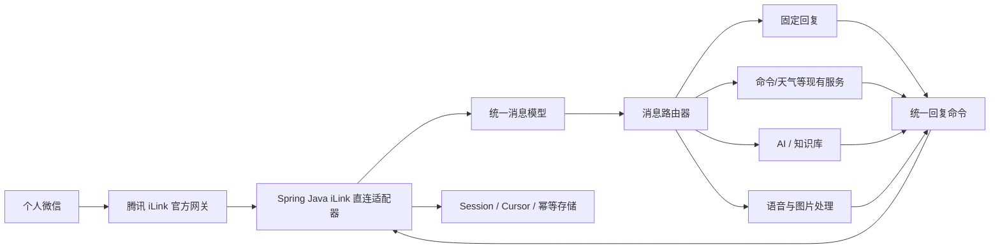

# 微信 iLink Cloud Bot Java 接入方案

## 1. 推荐结论

推荐采用“Spring Boot 业务核心 + 腾讯 iLink 直连适配器”方案。底层通道固定连接腾讯 iLink 官方网关，不替换成其他机器人协议；可替换的只是 Java 客户端实现。

- 第一阶段：在独立适配器中使用社区 Java SDK `io.github.morningwn:weixin-ilink-sdk:1.0.0`，直接连接 `https://ilinkai.weixin.qq.com`，完成二维码登录、文本接收和固定回复的 MVP。
- 第二阶段：加入消息路由、幂等、会话存储、语音转写、图片解密和 AI 回复。
- 生产阶段：继续直连腾讯 iLink，但对 Java 适配器做源码审计、协议契约测试和版本跟踪；腾讯官方 `@tencent-weixin/openclaw-weixin` 作为协议行为基线和兼容性参考。

不要让 Controller、命令处理或 AI 代码直接依赖某个 SDK 的 `WeixinMessage`。所有 SDK 对象先转换成项目自己的统一消息模型，这是保持腾讯 iLink 不变、同时允许 Java 客户端升级或替换的关键。

这里的“iLink 链接”不是一个永久 webhook 地址。初始登录使用腾讯固定入口获取二维码；扫码确认后，腾讯返回 `bot_token`、`ilink_bot_id`、`ilink_user_id` 和实际业务 `baseurl`。后续必须以返回的 `baseurl` 为准，通过 `getupdates` 长轮询收消息，并通过 `sendmessage` 回复。

## 2. iLink 和 Cloud Bot 是什么

iLink 是微信 ClawBot 使用的消息通道协议。它不是 WebSocket：登录通过微信扫码完成，接收消息使用 `getupdates` HTTP 长轮询，发送消息使用 `sendmessage`。每次回复必须携带入站消息中的 `context_token`，媒体文件还涉及 CDN 和 AES 加密。

Cloud Bot 不是一个独立的 Java SDK 名称，可以把它理解为部署在云端、通过 iLink 接入个人微信的机器人应用。它通常由四部分组成：微信通道、消息处理、业务/AI 能力、状态存储。

腾讯目前公开维护的是 TypeScript/OpenClaw 插件，并没有公开的腾讯官方 Java SDK。Maven Central 上存在社区 Java SDK，能用于 Java 17+ 项目，但维护规模和兼容性保障明显弱于腾讯官方插件。

## 3. 三种路线比较

| 路线 | 优点 | 缺点 | 适用场景 |
|---|---|---|---|
| 腾讯官方 OpenClaw 插件 | 官方维护、协议变化跟进快、AI/多账号能力完整 | Node/OpenClaw 技术栈，不能作为 Spring 的 Java SDK | 官方参考实现或允许独立网关时使用 |
| Spring 直接散落调用社区 Java SDK | 全 Java、起步快 | 业务绑死非官方 SDK，后续升级困难 | 仅一次性验证 |
| Spring 核心 + 腾讯 iLink 直连适配器 | 仍然直连腾讯；Java 业务稳定；SDK 可升级 | 初期多一层接口和消息映射 | 当前项目和长期演进，推荐 |

## 4. 推荐架构



### 模块划分

建议在 Spring 项目中按职责拆成以下模块或包：

```text
com.example.ykdsummer.bot
├── domain
│   ├── InboundMessage.java       # 项目自己的入站消息
│   ├── MessageContent.java       # Text/Voice/Image/File/Video
│   └── ReplyCommand.java
├── channel
│   ├── BotChannel.java           # 通道抽象接口
│   └── ilink
│       ├── ILinkSdkAdapter.java  # 唯一依赖社区 SDK 的位置
│       ├── ILinkMessageMapper.java
│       └── ILinkSessionStore.java
├── application
│   ├── MessageDispatcher.java
│   ├── FixedReplyHandler.java
│   ├── CommandMessageHandler.java
│   └── AiMessageHandler.java
├── media
│   ├── VoiceTranscriptService.java
│   └── ImageContentService.java
└── admin
    └── BotAdminController.java   # 二维码、状态、重登、指标
```

`BotChannel` 只暴露通用能力，例如：

```java
public interface BotChannel {
    void start(java.util.function.Consumer<InboundMessage> consumer);
    void send(ReplyCommand command);
    BotChannelStatus status();
    void relogin();
}
```

将来如果出现腾讯官方 Java SDK，只需替换 `BotChannel` 的底层实现；腾讯 iLink 网关和上层业务模型均不改变。若以后增加企业微信/飞书，则为它们新增独立通道实现，不影响 iLink 通道。

## 5. MVP 消息流程

1. Spring 启动 iLink 适配器。
2. 通过腾讯入口 `GET /ilink/bot/get_bot_qrcode?bot_type=3` 获取二维码。
3. 轮询 `get_qrcode_status`；用户扫码确认后，本地保存腾讯返回的 token、iLink Bot ID、用户 ID 和业务 base URL。当前 MVP 使用被 Git 忽略的属性文件，生产环境应改为密钥系统加密存储。
4. 适配器使用长轮询拉取消息，并持久化 `get_updates_buf` 游标。
5. 将 SDK 消息转换成统一消息类型：TEXT、VOICE、IMAGE、FILE、VIDEO、UNKNOWN。
6. 只处理 `USER` 消息，避免机器人消息再次触发回复形成循环。
7. 文本消息进入 `FixedReplyHandler`，产生固定回复。
8. 适配器使用原消息的 `from_user_id + context_token` 调用 `sendmessage`。
9. 以 `message_id` 做幂等，成功后再提交游标，减少重复回复。

## 6. 最值得先做的用途

最推荐先做“微信个人指令助手”，因为它与你当前项目已有的命令和天气服务最匹配：

- 用户发送“天气 上海”，机器人调用现有 `WeatherService` 返回结果。
- 用户发送固定命令，路由到现有 `CommandService`。
- 未识别命令先返回固定帮助文本。
- 后续再给未识别文本接入大模型，而不是一开始所有消息都调用 AI。

这条路线成本低、响应快、容易验证，也能自然演进成：个人 AI 助手、内部运维指令、任务提醒、知识库问答和轻量客服。

不建议第一阶段做群发营销、关键交易指令或无限制远程执行命令。消息入口必须配白名单、命令权限、审计日志和速率限制。

## 7. 扩展路线

### 阶段 A：文本 MVP

- 二维码登录和 session 恢复
- 长轮询接收
- 消息类型识别
- 文本固定回复
- 状态/二维码管理接口
- 消息 ID 幂等和游标持久化

### 阶段 B：业务机器人

- 命令路由和参数解析
- 复用现有天气、命令服务
- 用户白名单、限流、审计日志
- Redis 保存 session、游标、幂等键和会话状态

### 阶段 C：AI 与媒体

- AI Provider 接口，可切换不同模型
- 对话记忆、知识库和敏感内容过滤
- 使用语音消息已有的转写文本
- 图片 CDN 下载、AES 解密、OCR/视觉模型
- 文件和视频异步处理

### 阶段 D：生产化

- iLink 网关与业务服务分离部署
- PostgreSQL/Redis 持久化
- 重试、死信队列、指标和告警
- 多账号隔离及密钥管理
- 协议契约测试，跟踪官方插件版本变化

## 8. 关键技术与安全要求

- `context_token` 是回复路由所需的会话令牌，不应当作永久地址保存或长期延迟使用。
- `get_updates_buf` 必须持久化；业务处理成功后再提交新游标。
- 使用 `message_id` 幂等。网络超时不等于发送失败，重试可能产生重复消息。
- token/session 不进入 Git，不在日志或管理 API 中返回；生产环境应使用 KMS、Vault 或至少操作系统密钥保护。
- 管理接口仅监听内网，并做身份认证；二维码 URL 同样视为敏感信息。
- 图片、语音、文件经 CDN 传输并涉及 AES，必须限制大小、类型和存储时间。
- 不依据非官方截图判断账号“绝对安全”；上线前阅读并遵守微信 ClawBot 功能条款和官方插件说明。

## 9. 当前建议的技术选型

| 位置 | MVP | 生产建议 |
|---|---|---|
| Java | Java 21 | Java 21 LTS |
| 框架 | Spring Boot 4.1 | Spring Boot 4.x |
| iLink | 社区 Java SDK 1.0.0，封装在腾讯 iLink 直连适配器内 | 经过审计并带契约测试的 Java 直连适配器；持续跟踪腾讯官方插件协议变化 |
| 状态 | 本地加密文件 | Redis + 密钥管理 |
| 业务路由 | Spring Bean Handler Chain | Handler Chain + 消息队列 |
| AI | 暂不接入 | 独立 `AiProvider` 接口 |
| 运维 | 日志 + 状态 API | Metrics、Tracing、告警、审计 |

## 10. 验收标准

- 首次启动能生成可扫描二维码。
- 扫码后重启服务无需再次扫码，session 过期时能重新登录。
- 文本消息在一个长轮询周期内被识别并回复固定内容。
- 机器人自己发出的消息不会触发循环回复。
- 同一个 `message_id` 不会被重复处理。
- 文本、语音、图片、文件、视频均能正确分类；MVP 只回复文本。
- SDK 替换不影响 `MessageDispatcher`、命令服务和 AI 服务。

## 11. 参考资料

- [腾讯官方 openclaw-weixin 仓库](https://github.com/Tencent/openclaw-weixin)
- [腾讯官方 npm 组织](https://www.npmjs.com/org/tencent-weixin)
- [Java 社区 SDK](https://github.com/morningwn/weixin-ilink-sdk)
- [Maven Central：weixin-ilink-sdk 1.0.0](https://central.sonatype.com/artifact/io.github.morningwn/weixin-ilink-sdk)
