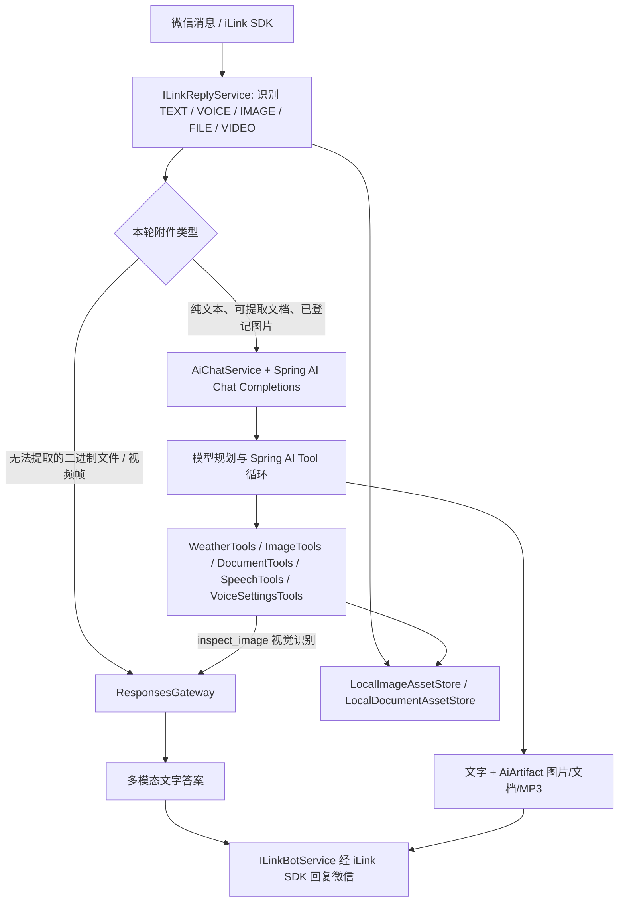

# 微信 Agent 编排与资源版本（当前实现）

本项目不再要求用户记住“生图：”“生成文件：”等前缀。用户照常说话；模型根据工具说明自行决定直接回答、查询天气、生成/修改图片、创建/修改文档、生成语音或切换音色。



## 1. 资源、用户与版本

每个微信用户都有独立资源目录，按用户摘要分开保存，任何工具都只能在当前用户自己的目录内查询：

```text
.ai-assets/
├── images/<用户摘要>/
│   ├── current-image.properties
│   └── img_a1b2c3d4e5f6/
│       ├── metadata.properties
│       ├── v1.png
│       ├── v2.png
│       └── v3.png
└── documents/<用户摘要>/
    ├── current-document.properties
    └── doc_a1b2c3d4e5f6/
        ├── metadata.properties
        ├── v1-原文件.docx
        ├── v2-原文件.docx
        └── v3-原文件.docx
```

- **新生成或新上传的图片**：创建独立 `img_*`，从 `v1` 开始。
- **修改图片**：仍使用同一个 `img_*`，追加 `v2`、`v3`。当前 `gpt-image-2` 接入使用文生图 Images API，因此“修改”是依据上一版描述、视觉摘要和用户要求重新生成，而不是像素级无损修图。
- **回退图片**：不删除后续版本；把目标历史内容复制为新的当前版本。例如当前 v3 回到 v1，结果会生成 v4，且 v1～v3 仍可追踪。
- **文件同理**：上传文件创建 `doc_* v1`；新建、修改、格式转换、回退均追加版本。
- `current-*.properties` 是当前资源指针，`metadata.properties` 记录版本、文件名、来源、摘要、创建时间；两者都会落盘，程序重启后仍能恢复。

`ConcurrentHashMap` 只做当前资源的内存加速缓存，不是唯一存储；重启后会由磁盘指针恢复。

## 2. 图片如何“智能定位”

模型不会只凭“上一张”猜图，工具按以下顺序工作：

1. 用户说“改上一张图”“把那只猫改成白色”时，模型先调用 `get_current_image`；若用户提到多张图或“那个人”，先调用 `list_recent_images`。
2. 返回的数据包含 `assetId`、版本、来源、原始画面描述和已保存的视觉摘要。
3. 若问题依赖真实画面（例如猫的颜色、人物衣服），模型调用 `inspect_image(assetId, question)`。这个工具会把**对应本地原图**走 Responses 视觉通道识别，并把识别结果写回该版本的元数据标签。
4. 模型再调用 `create_image_revision(assetId, prompt)` 或 `restore_image_version(assetId, version)`。
5. 工具产生的图片作为 `AiArtifact` 回到 iLink，微信直接收到图片；后续文字会带出编号和版本，便于人和模型都可追踪。

因此，用户即使连续生成“橘猫”和“穿蓝外套的人”，模型也能先列出当前用户的资源，再以编号、原始描述和视觉摘要选择正确的目标。模型不确定时应先追问，不应随意改动别的图片。

## 3. 文档工具链

- `create_document(title, format, content)`：生成 `doc_* v1`。
- `get_current_document()`：读取当前文档的 ID、版本历史和可提取正文预览。
- `replace_document_content(assetId, content, format, changeSummary)`：生成同一 `doc_*` 的下一版；不会覆盖旧文件。
- `restore_document_version(assetId, targetVersion)`：将历史版本复制成一个新版本。

文件正文能本地提取时，先把正文、ID 和版本交给 Chat Completions Agent，使模型能够调用上述工具；无法提取的二进制附件仍走 Responses 做理解，但不会伪造“已修改文件”。DOCX、XLSX、PDF 的修改/转换目前是内容级重新渲染，复杂样式、公式、图片和版式不承诺无损保留。

## 4. 协议不是用户选择项

- **Chat Completions + Spring AI**：用于纯文本、可提取文档和已登记的图片资产。Spring AI 把工具清单发给模型，自动完成“模型请求工具 → Java 执行 `@Tool` → 工具结果回传模型 → 最终回答”的循环。
- **Responses**：用于无法提取的文件、视频帧，及 `inspect_image` 的视觉识别。第一次收到图片时会先落为 `img_*`，Agent 再把指定本地图片通过这个通道读入；它接收 `input_image` / `input_file` 等多模态输入。
- **OpenAI Images API**：图片生成专用协议，不是上述两种文字协议。`AiImageGenerationService` 通过官方 Java SDK 向 `POST /v1/images/generations` 发送 `model=gpt-image-2`、`prompt`、`size`、`quality`，读取 Base64 PNG；`ImageTools` 再登记版本并回传微信。

当前 `create_image_revision` 会先用 Responses 识别原图，再把“原图摘要 + 新要求”交给 Images API 重新绘制；请求中**没有原图二进制**。所以它是可追踪的“语义重绘”，不是真正 image-to-image。要做保留人物身份、局部替换等真图生图，后续要接供应商确认支持的 `/v1/images/edits`（或等价）接口。

用户只需提出目标，代码根据附件是否需要多模态能力选网关；模型根据问题选工具。这两个选择互不冲突。

## 5. 当前边界与下一步

- 聊天历史是 `AiChatService` 的按用户短期内存，重启会清空；资源文件和资源版本会保留在 `.ai-assets/`。
- `清空` 清的是聊天上下文和“等待下一句指令”的临时文件会话，不会自动删除已登记的图片/文档版本，避免误删用户资产。
- 本地资产是单机方案；后续替换为 OSS（保存二进制）+ 数据库（保存 `userId/assetId/version/tag/audit`）即可扩展到多机器。
- 图片编辑暂不等价于专业图像编辑 API；如需要局部修补、保留人物身份等，应后续接入支持 image-to-image / edit 的模型接口。
