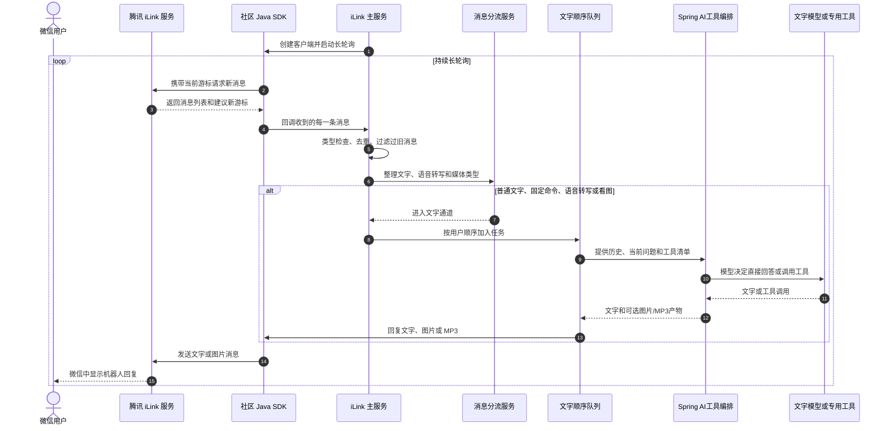
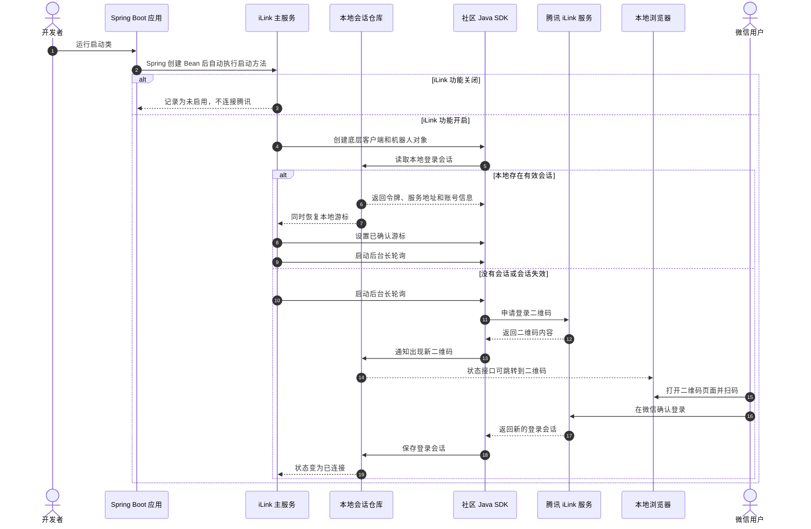
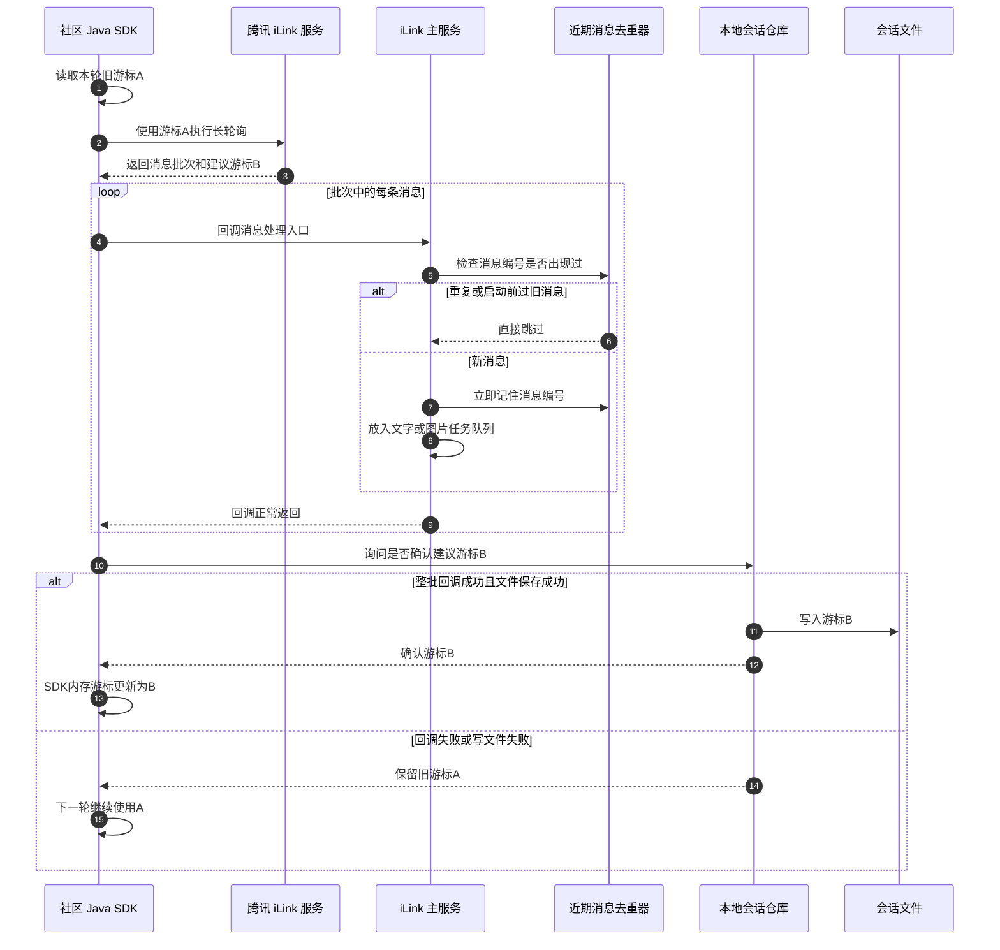
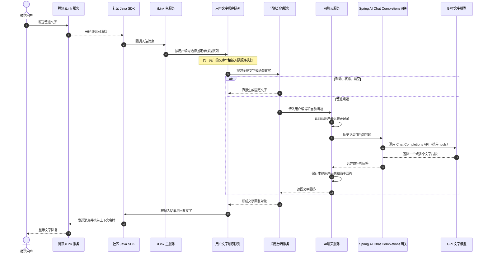
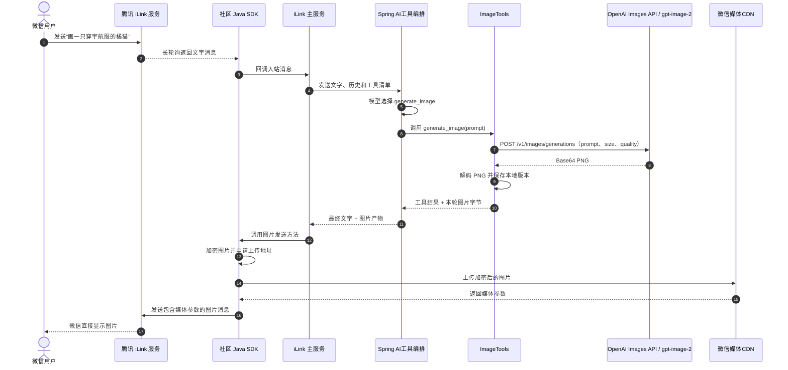
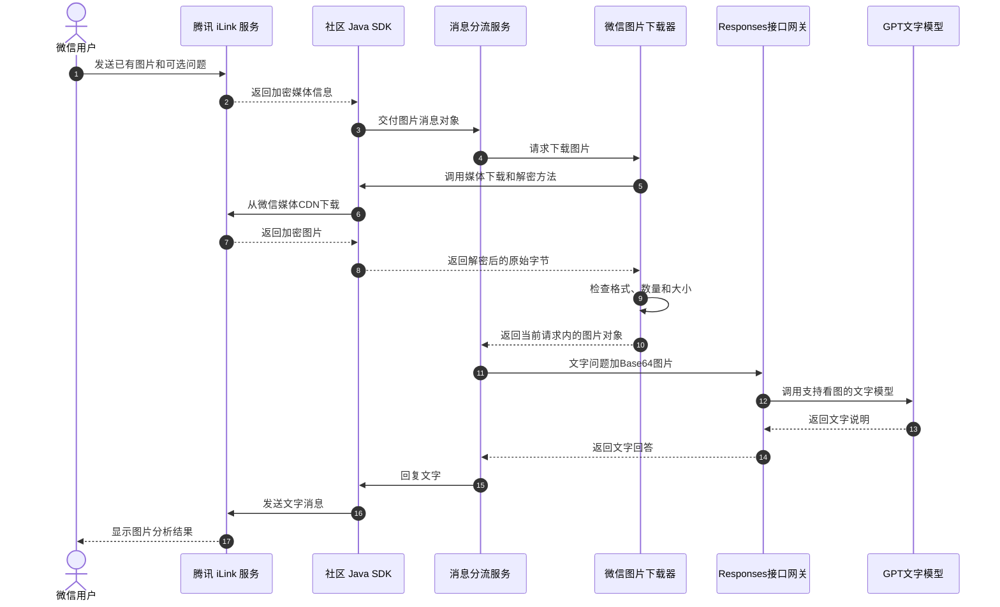
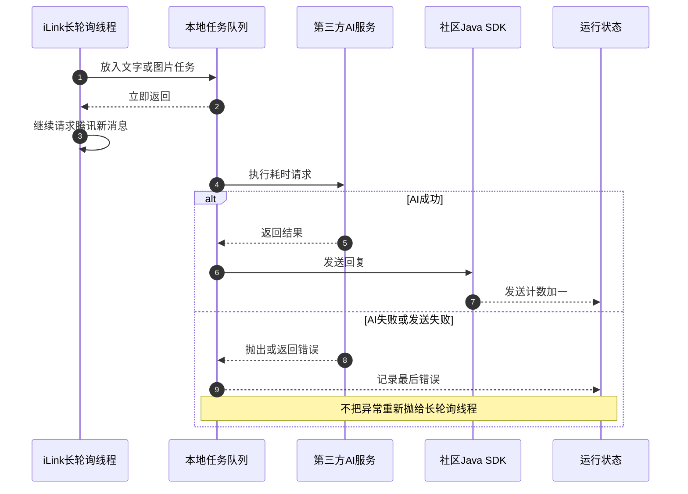

# 微信 iLink + AI 机器人：项目流程与中文时序图

> 本文完全依据当前 `D:\YKD-summer` 项目的真实代码编写。
> 图中以中文说明业务含义；括号里的英文是源码中的真实类名或方法名，方便点击文件后查找。

## 1. 一句话理解整个项目

这个程序做了五件事：

1. Spring Boot 启动 Java 应用；
2. 社区 Java SDK 使用本地会话连接腾讯 iLink，没有会话时生成二维码；
3. SDK 通过 `getupdates` 长轮询接收微信消息；
4. Java 先按媒体类型整理消息；普通自然语言交给模型，模型决定是否调用天气、生图、TTS 或音色设置工具；
5. 得到结果后，SDK 使用 `sendmessage` 把文字、图片或 MP3 文件发回微信。

```text
微信用户
  → 腾讯 iLink 服务
  → 社区 Java SDK
  → ILinkBotService
  → ILinkReplyService
  → 文字模型 / 图片模型 / 固定命令
  → 社区 Java SDK
  → 腾讯 iLink 服务
  → 微信用户
```

## 2. 最应该先认识的文件

| 阅读顺序 | 文件 | 主要职责 |
|---|---|---|
| 1 | [YkdSummerApplication.java](../../src/main/java/com/example/ykdsummer/YkdSummerApplication.java) | Spring Boot 启动入口 |
| 2 | [ILinkBotService.java](../../src/main/java/com/example/ykdsummer/bot/service/ILinkBotService.java) | 创建 SDK、启动长轮询、接收消息、调度任务、发送回复 |
| 3 | [ILinkSessionStore.java](../../src/main/java/com/example/ykdsummer/bot/session/ILinkSessionStore.java) | 保存登录会话和消息游标 |
| 4 | [ILinkReplyService.java](../../src/main/java/com/example/ykdsummer/bot/service/ILinkReplyService.java) | 提取消息内容并决定走哪个功能分支 |
| 5 | [AiChatService.java](../../src/main/java/com/example/ykdsummer/ai/service/AiChatService.java) | 保存每个用户的文字上下文并调用文字模型 |
| 6 | [OpenAiResponsesGateway.java](../../src/main/java/com/example/ykdsummer/ai/service/OpenAiResponsesGateway.java) | 组装 Responses API 请求并读取文字结果 |
| 7 | [RoutingLlmGateway.java](../../src/main/java/com/example/ykdsummer/ai/service/RoutingLlmGateway.java) | 纯文本走 Spring AI Completion；图片、文件、视频帧走 Responses |
| 8 | [AiImageGenerationService.java](../../src/main/java/com/example/ykdsummer/ai/service/AiImageGenerationService.java) | 调用 OpenAI Images 兼容 `gpt-image-2` 生成图片字节 |
| 9 | [ILinkMediaDownloader.java](../../src/main/java/com/example/ykdsummer/bot/service/ILinkMediaDownloader.java) | 下载并解密用户发来的微信图片 |
| 10 | [ILinkFileDownloader.java](../../src/main/java/com/example/ykdsummer/bot/service/ILinkFileDownloader.java) | 下载、解密并校验用户发来的微信文件 |
| 11 | [ILinkController.java](../../src/main/java/com/example/ykdsummer/bot/controller/ILinkController.java) | 提供状态、二维码和主动发文字的本地 HTTP 接口 |
| 12 | [application.properties](../../src/main/resources/application.properties) | iLink、文字模型、图片模型、超时等配置 |

## 3. 总体时序图



这张图最重要的结论：

- iLink 长轮询线程只负责收消息和入队，不等待 AI；
- 同一用户的文字消息保持顺序；
- 生图、TTS、音色设置不再依赖 `生图：`、`语音：`等前缀，而是由模型根据工具说明判断；
- 当前同一用户的普通消息仍保持顺序，工具调用在该消息处理过程中完成；后续如需更高并发，可把耗时工具移动到独立的 Agent 工具执行队列。

## 4. Spring 启动、恢复登录和扫码登录

### 4.1 启动时序图



### 4.2 对应真实方法

```text
YkdSummerApplication.main(...)
→ SpringApplication.run(...)
→ ILinkBotService.start()
→ new ILinkClient(...)
→ new ILinkBot(..., sessionStore)
→ ILinkSessionStore.loadSession()
→ ILinkSessionStore.loadCursor()
→ ILinkBot.setGetUpdatesBuf(...)
→ ILinkBot.startAutoPull(...)
```

如果没有有效会话，SDK 内部继续执行：

```text
getBotQrcode()
→ ILinkSessionStore.onQrcode(...)
→ 用户扫码确认
→ ILinkSessionStore.persistSession(...)
```

本地会话文件是 `.ilink/session.properties`。它同时保存登录令牌和游标，属于敏感文件，不能提交到 Git。

## 5. 长轮询、消息批次和游标

### 5.1 游标是什么意思

游标可以理解成“腾讯消息队列的阅读书签”。

- 旧游标：本轮请求之前已经确认的位置；
- 建议新游标：腾讯返回本批消息时建议移动到的位置；
- SDK 内存游标：下一次 `getupdates` 真正携带的位置；
- 本地文件游标：程序重启后恢复的位置。

### 5.2 游标时序图



### 5.3 当前异步实现必须理解的权衡

当前 `handleInboundMessage(...)` 把任务成功放入本地队列后就返回。因此：

```text
“SDK 判断批次已处理”
= 消息已经成功进入本地任务队列
≠ AI 已经回答完成
≠ 回复已经发送到微信
```

好处是慢 AI 不会阻塞 iLink 长轮询；代价是任务入队后如果 Java 进程突然崩溃，腾讯游标可能已经前进，但内存任务还没执行完。当前 Demo 接受这个权衡，生产系统应使用数据库或持久化消息队列。

## 6. 普通文字和多轮对话

### 6.1 文字时序图



### 6.2 文字顺序和聊天记忆

- 项目有 8 条单线程文字队列；同一用户根据用户编号固定进入同一条；
- 同一用户连续发“我叫小明”“我叫什么”时，会先处理第一条再处理第二条；
- 不同用户通常可以并行，但哈希碰巧落到同一队列时也会排队；
- 聊天记录以 `fromUserId` 为键隔离；
- 每个用户最多保存最近 20 条用户/助手文字；
- 空闲 2 小时后自动清理；
- `清空`只删除当前用户的聊天记录；
- `store=false`，模型服务端不保存本项目依赖的会话状态，每次由 Java 携带历史。

文字请求默认模型为 `gpt-5.6-sol`，单次最长等待 60 秒，不重试。

## 7. 模型自主选择的生图工具

### 7.1 自然语言入口

用户不需要记住固定前缀。下面三句话都会先走同一条普通文本链，随后由模型依据
`generate_image` 工具说明决定是否创建图片：

```text
画一只穿宇航服的橘猫站在月球上
给我做一张适合作为头像的赛博朋克猫咪
把刚才的描述画出来
```

### 7.2 生图时序图



当前图片由 `AiImageGenerationService` 通过官方 OpenAI Java SDK 调用 `gpt-image-2` 的 Images API 完成；工具失败时会返回文字错误，不能破坏 iLink 的长轮询和游标。当前工具随该用户的文字队列同步完成，因此同一用户的历史不会乱序。该接口现在是文生图：图片“改版”会利用原图摘要重新绘制，不会上传原图字节做像素级图生图。

## 8. 用户发图片让机器人理解

“生成图片”和“理解用户发来的图片”是两个不同功能：



当前限制：

- 一次最多 3 张；
- 单张最大 5 MiB；
- 合计最大 10 MiB；
- 支持 JPEG、PNG、WebP；
- 图片只存在于当前请求内存，不写文件，也不放进聊天历史。

## 9. 语音消息

当前项目不自己进行语音识别，而是读取微信消息对象中的转写文字：

```text
语音带转写文字
→ 把转写内容当作普通文字问题
→ 进入文字顺序队列
→ GPT 返回文字回答

语音没有转写文字
→ 不调用模型
→ 回复“暂时无法识别，请改发文字”
```

## 10. 固定命令

固定命令只有在整条文字精确匹配且没有附带图片时生效：

| 命令 | 行为 |
|---|---|
| `帮助` | 显示当前支持的功能 |
| `状态` | 显示 iLink 连接、长轮询和 AI 模型状态，不显示密钥 |
| `清空` | 清除当前微信用户的文字聊天记录 |

## 11. 连接状态接口

浏览器打开：

```text
http://127.0.0.1:8080/api/ilink/status
```

常见状态：

| 状态 | 含义 |
|---|---|
| `DISABLED` | iLink 开关关闭 |
| `STARTING` | 正在创建 SDK 或等待登录 |
| `WAITING_FOR_QR_SCAN` | 已生成二维码，等待扫码 |
| `CONNECTED` | 已有有效登录会话 |
| `ERROR` | 启动、会话或游标持久化发生整体故障 |

`polling=true` 表示 SDK 的自动拉取线程正在运行。`CONNECTED` 表示有有效会话，两者一起为正常连接状态。

## 12. 异常为什么不会拖垮 iLink



这解决了之前“图片或文字模型很慢时，ClawBot 看起来离线”的问题。

## 13. 当前配置摘要

| 配置 | 当前默认值 |
|---|---|
| iLink 服务 | `https://ilinkai.weixin.qq.com` |
| 文字模型 | `gpt-5.6-sol` |
| 文字超时 | 60 秒，不重试 |
| 图片模型 | `gpt-image-2` |
| 图片尺寸 | `1024x1024` |
| 图片质量 | `medium` |
| 图片超时 | 6 分钟，不重试 |
| 每用户文字历史 | 最近 20 条 |
| 历史空闲过期 | 2 小时 |
| 文字队列 | 8 条单线程队列 |
| 图片队列 | 2 个工作线程 |
| 去重窗口 | 最近 1000 个消息编号 |

## 14. 最终记忆口诀

```text
Session 是“我是谁、如何登录”
Cursor 是“消息读到哪里”
ContextToken 是“这条回复属于哪个微信会话”
MessageId 是“这条消息是否已经见过”

长轮询负责不断收消息
文字队列负责保持对话顺序
图片队列负责慢慢生成图片
ReplyService 负责决定走哪条路
SDK 负责把 Java 对象变成 iLink 网络请求
```

## 15. 对照老师图片中的学习与演示要求

这一节不是新增功能，而是把图片里的要求逐项对应到当前真实代码。汇报时可以按下表说明。

| 图片中的要求 | 当前项目对应位置 | 当前状态 | 应该怎样讲 |
|---|---|---|---|
| 理解 SDK 怎样连接微信 | [ILinkBotService.java](../../src/main/java/com/example/ykdsummer/bot/service/ILinkBotService.java) 的 `start()` | 已完成 | Java 创建 `ILinkClient` 和 `ILinkBot`，SDK 再连接腾讯 iLink，不是 Java 直接连接手机微信进程 |
| 登录凭证的获取和保存 | [ILinkSessionStore.java](../../src/main/java/com/example/ykdsummer/bot/session/ILinkSessionStore.java) 的 `loadSession()`、`persistSession(...)`、`onQrcode(...)` | 已完成 | 首次没有会话时扫码；成功后把会话写入 `.ilink/session.properties`，下次启动优先恢复 |
| 理解上下文 `contextToken` | [ILinkBotService.java](../../src/main/java/com/example/ykdsummer/bot/service/ILinkBotService.java) 的回复和生图发送逻辑 | 已完成 | 它来自入站消息，回复时原样交给 SDK，用于告诉腾讯“这条回复属于哪次微信对话” |
| 理解游标 `cursor/getUpdatesBuf` | [ILinkSessionStore.java](../../src/main/java/com/example/ykdsummer/bot/session/ILinkSessionStore.java) 的 `loadCursor()`、`confirmGetUpdatesBuf(...)` | 已完成 | 游标只表示消息读取进度，不保存聊天内容；第 5 节时序图是重点 |
| 理解消息监听机制 | [ILinkBotService.java](../../src/main/java/com/example/ykdsummer/bot/service/ILinkBotService.java) 的 `startAutoPull(this::handleInboundMessage)` | 已完成 | SDK 用 `getupdates` 长轮询，有消息就回调 `handleInboundMessage(...)` |
| 理解消息类型处理 | [ILinkReplyService.java](../../src/main/java/com/example/ykdsummer/bot/service/ILinkReplyService.java) | 已完成当前版本 | 文字、图片、文件、语音转写、短视频和固定命令均已有明确分流；文件上传后缓存 5 分钟，下一条普通话由模型识别分析、修改、转换或生成意图 |
| 理解加密资源 | [ILinkMediaDownloader.java](../../src/main/java/com/example/ykdsummer/bot/service/ILinkMediaDownloader.java)、[ILinkFileDownloader.java](../../src/main/java/com/example/ykdsummer/bot/service/ILinkFileDownloader.java) 与 [ILinkVideoDownloader.java](../../src/main/java/com/example/ykdsummer/bot/video/ILinkVideoDownloader.java) | 已完成图片、文件和短视频 | 微信媒体先从 CDN 下载密文，再由 SDK 解密；文件转为当前轮 `input_file`，视频抽 10 帧并提取 WAV，二进制不写入聊天历史 |
| 理解视频声音 | [FfmpegVideoAudioExtractor.java](../../src/main/java/com/example/ykdsummer/bot/audio/FfmpegVideoAudioExtractor.java) 与 [TencentCloudAsrService.java](../../src/main/java/com/example/ykdsummer/bot/audio/TencentCloudAsrService.java) | 已完成代码与本地测试 | 视频音轨转成 16kHz 单声道 WAV，直接上传腾讯一句话识别；返回文字与 10 帧共同交给 LLM |
| 理解消息发送机制 | [ILinkBotService.java](../../src/main/java/com/example/ykdsummer/bot/service/ILinkBotService.java) 的文字回复与图片回复方法 | 已完成 | 文字走 `replyText(...)`；图片走 `sendImage(...)`，SDK 内部还会加密和上传 CDN |
| 理解异常与重试 | [OpenAiClientConfiguration.java](../../src/main/java/com/example/ykdsummer/ai/config/OpenAiClientConfiguration.java) 和第 12 节 | 已完成当前策略 | 当前模型调用不自动重试；失败只回复友好提示，不中断 iLink 长轮询 |
| 接入 LLM，完成基本中文对话 | [AiChatService.java](../../src/main/java/com/example/ykdsummer/ai/service/AiChatService.java) 与 [OpenAiResponsesGateway.java](../../src/main/java/com/example/ykdsummer/ai/service/OpenAiResponsesGateway.java) | 已完成 | 普通问题连同当前用户最近的历史一起发送给文字模型 |
| 不同用户的上下文隔离 | [AiChatService.java](../../src/main/java/com/example/ykdsummer/ai/service/AiChatService.java) | 已完成 Caffeine 内存版 | 使用微信用户编号作为键；每个用户最多保留最近 20 条，空闲 2 小时淘汰，缓存用户总数有上限 |
| 学习 Agent | 当前没有 Agent 工具调用层 | 未完成、也不是本阶段必要功能 | 现在是“收到问题→调用模型→返回回答”的聊天机器人，还不是能自主调用工具的 Agent |
| Spring AI / LangChain4j | [pom.xml](../../pom.xml) 已引入 Spring AI 1.1.8；当前未使用 LangChain4j | 纯文本 Completion 与天气 Tool 已接入；完整业务 Agent 待扩展 | 普通文件/多模态仍走已验证的 Responses 网关；纯文本可由 Spring AI 调用 Tool |

### 15.1 哪些代码属于 SDK，哪些属于我们项目

```text
SDK 已经封装：
二维码登录、会话请求、getupdates 长轮询、iLink 请求格式、
文字发送、图片加密上传、媒体下载解密等底层能力。

本项目自己实现：
会话和游标写本地文件、消息去重、启动期旧消息过滤、
文字/图片线程分流、固定命令、聊天历史、调用大模型、错误提示。
```

所以“学习 SDK 源码”不是要求重新写一套 iLink，而是要能够回答：

1. 项目调用了 SDK 的哪个入口；
2. SDK 收到调用后向腾讯发送了什么类型的请求；
3. 腾讯返回数据后 SDK 回调了项目的哪个方法；
4. 项目何时确认游标，何时调用 SDK 发送回复；
5. 哪些规则是 SDK 自带的，哪些规则是项目自己加的。

### 15.2 演示时建议按照这个顺序讲

1. 打开第 3 节总体图，用一分钟说明完整链路；
2. 打开第 4 节，说明首次扫码和重启恢复登录；
3. 打开第 5 节，重点解释长轮询、旧游标和建议新游标；
4. 打开第 6 节，演示普通文字和同一用户多轮对话；
5. 打开第 7、8、9 节，演示生图、看图和语音转写；
6. 最后说明第 5.3 节的异步游标权衡，以及 Agent 尚未实现。

演示时最重要的是如实说明：当前项目已经完成 iLink 通信、文字模型、图片输入与图片生成；但没有 Agent、数据库和持久化任务队列。
