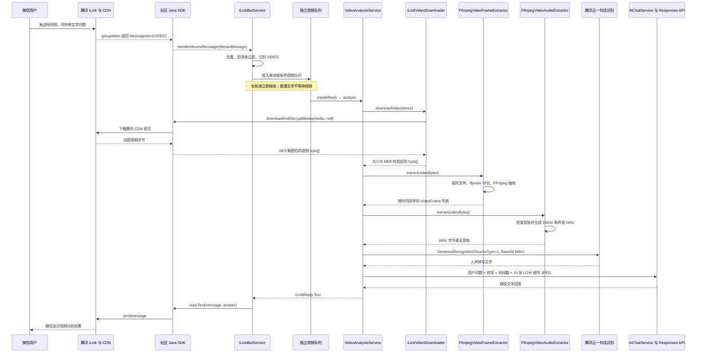

# 微信 iLink 短视频理解：运行与源码导读

## 1. 功能结论

当前项目会同时处理微信短视频的画面和声音，再交给原有 Responses API 生成文字分析。
它不是把视频或音频文件直接发给 GPT，而是先在 Java 本地完成两条转换：

```text
微信 VideoItem
→ 腾讯 CDN 加密媒体
→ Java SDK 下载并 AES 解密
→ 完整视频 byte[]
├→ FFmpeg 固定抽取 10 张 JPEG → List<AiImage(detail=LOW)>
└→ FFmpeg 提取 16kHz 单声道 WAV → 腾讯云 ASR → 转写文字
→ 用户问题 + ASR 转写 + 10 张图片
→ Responses API 同一条多模态 user message
→ ILinkReply.Text
→ SDK replyText
→ 微信显示文字回答
```

腾讯 ASR 负责把人声变成文字，LLM 再结合这段文字和 10 张画面理解视频。音乐、纯环境音
和音效不一定能被 ASR 准确描述；ASR 失败时会自动降级为只看 10 张画面。

## 2. 完整时序图



## 3. 启动前准备

本机已经通过 Winget 安装 FFmpeg 8.1.2。项目启动时按下面顺序寻找程序：

1. 使用 `FFMPEG_PATH` 和 `FFPROBE_PATH` 指定的路径；
2. 使用系统 PATH 中的 `ffmpeg`、`ffprobe`；
3. Windows 下自动寻找当前用户 Winget 的 FFmpeg 包目录。

IntelliJ 环境变量仍需要保留原有三项：

```text
AI_API_KEY=文字与图片理解接口密钥
AI_ENABLED=true
ILINK_ENABLED=true
```

视频音轨转写还需要：

```text
TENCENT_ASR_ENABLED=true
TENCENTCLOUD_SECRET_ID=腾讯云测试或子账号 SecretId
TENCENTCLOUD_SECRET_KEY=对应 SecretKey
TENCENT_ASR_REGION=
```

`SecretId/SecretKey` 禁止写入 `application.properties` 或提交到 Git。没有配置时不会阻止
视频画面分析，只会在提示词中说明“没有可用的音频转写”。

图片生成仍使用独立的 `AI_IMAGE_API_KEY`。视频理解不使用图片生成 API。

如果自动发现失败，可以在 IntelliJ 环境变量中额外填写：

```text
FFMPEG_PATH=C:\完整路径\ffmpeg.exe
FFPROBE_PATH=C:\完整路径\ffprobe.exe
```

然后重新启动 `YkdSummerApplication`。

## 4. 微信怎样使用

可以直接发送：

```text
一个 60 秒以内、20 MiB 以内的视频
```

没有附带问题时，程序使用默认问题：

```text
请概括这个视频画面中发生了什么
```

如果 iLink 把文字和视频放在同一条消息中，文字会成为视频问题，例如：

```text
视频里的人先后做了什么？
```

第一版限制：

- 一条消息只能有一个视频；
- 视频与额外图片不能在同一条消息中混发；
- 最长 60 秒；
- 最大 20 MiB；
- 固定抽取 10 帧；
- 人声通过腾讯 ASR 转成文字；音乐、音效和纯环境声不保证能识别；
- 视频任务独立排队，最多等待 5 条。

## 5. 最重要的源码阅读顺序

### 5.1 消息在哪里被识别

文件：`src/main/java/com/example/ykdsummer/bot/service/ILinkReplyService.java`

重点方法：

- `extract(...)`：发现 `MessageItem.type=VIDEO` 后设置 `hasVideo=true`；
- `isVideoMessage(...)`：供主服务选择视频队列；
- `createReply(...)`：调用 `VideoAnalysisService.analyze(...)`。

### 5.2 为什么不会卡住普通文字

文件：`src/main/java/com/example/ykdsummer/bot/service/ILinkBotService.java`

视频使用一个独立 `ThreadPoolExecutor`：

```text
工作线程数：1
等待队列容量：5
队列满：拒绝新任务并回复“当前视频任务较多，请稍后重试”
```

消息成功进入队列后，SDK 回调立即返回，`getupdates` 长轮询不会等待 FFmpeg 或模型。
这也意味着当前 Demo 的视频任务只存在内存里：入队后如果 Java 进程立即崩溃，腾讯游标
可能已经前进，但任务尚未完成。生产环境需要持久化任务队列。

### 5.3 腾讯视频怎样变成普通字节

文件：`src/main/java/com/example/ykdsummer/bot/video/ILinkVideoDownloader.java`

核心调用：

```java
client.downloadAndDecryptMedia(videoItem.media(), null)
```

`null` 表示让 SDK 使用 `CDNMedia.aesKey()`。下载前先检查 SDK 给出的 `videoSize`，
下载后再检查真实 byte[] 大小；如果协议提供 32 位十六进制 MD5，还会校验内容完整性。

### 5.4 怎样决定抽几帧

文件：`src/main/java/com/example/ykdsummer/bot/video/FfmpegVideoFrameExtractor.java`

步骤：

1. 把解密视频写入系统临时目录；
2. `ffprobe` 读取真实时长；
3. 当前把最少帧和最多帧都配置为 10，因此固定抽取 10 帧；
4. 时间点选每个等分区间的中点；
5. FFmpeg 输出最长边不超过 768 的 JPEG；
6. 所有帧总大小不能超过 5 MiB；
7. 在 `finally` 中删除临时视频、JPEG 和 FFmpeg 日志。

例如 12 秒视频抽 10 帧，时间点均匀分布在十个区间的中点：

```text
0.6 秒、1.8 秒、3.0 秒、4.2 秒、5.4 秒、6.6 秒、7.8 秒、9.0 秒、10.2 秒、11.4 秒
```

### 5.5 怎样把视频声音变成文字

文件：`src/main/java/com/example/ykdsummer/bot/audio/FfmpegVideoAudioExtractor.java`

它先用 ffprobe 检查是否存在音轨，再用 FFmpeg 输出 `16kHz + 单声道 + 16-bit PCM WAV`。
60 秒 WAV 大约 1.92 MiB，低于一句话识别的 3 MiB 限制。临时视频和 WAV 会在 `finally`
中删除。

文件：`src/main/java/com/example/ykdsummer/bot/audio/TencentCloudAsrService.java`

它使用腾讯云官方 Java SDK 构造 `SentenceRecognitionRequest`：

```text
EngSerViceType = 16k_zh
SourceType = 1（直接上传本地音频数据）
VoiceFormat = wav
Data = WAV 的 Base64 字符串
DataLen = WAV 原始字节数
```

返回的 `Result` 才是交给 LLM 的转写文字，原始 WAV 不进入聊天历史，也不写入永久文件。

### 5.6 怎样把帧和转写一起交给模型

文件：`src/main/java/com/example/ykdsummer/bot/video/VideoAnalysisService.java`

它把用户问题、ASR 转写、帧数和时间戳写进同一份提示词，再把 `List<VideoFrame>`
转换成 `List<AiImage>`，调用现有 `AiChatService.answer(...)`。

文件：`src/main/java/com/example/ykdsummer/ai/service/OpenAiResponsesGateway.java`

网关把每帧变成：

```json
{
  "type": "input_image",
  "detail": "low",
  "image_url": "data:image/jpeg;base64,..."
}
```

全部帧按时间顺序放进同一条 user message。模型成功回答后，当前用户的视频问题与
模型文字回答会进入现有内存聊天记录，后续可以继续追问。

## 6. 配置说明

配置位于 `src/main/resources/application.properties`：

| 环境变量 | 默认值 | 用途 |
|---|---:|---|
| `VIDEO_ENABLED` | `true` | 是否启用视频分析 |
| `VIDEO_MAX_SIZE` | `20MB` | 单视频最大大小 |
| `VIDEO_MAX_DURATION` | `60s` | 最大时长 |
| `VIDEO_MIN_FRAMES` | `10` | 最少帧数；与最大值相同表示固定抽 10 帧 |
| `VIDEO_MAX_FRAMES` | `10` | 最多帧数 |
| `VIDEO_SECONDS_PER_FRAME` | `3` | 动态抽帧密度；固定 10 帧时不影响结果 |
| `VIDEO_MAX_FRAME_DIMENSION` | `768` | 单帧最长边 |
| `VIDEO_MAX_TOTAL_FRAME_SIZE` | `5MB` | 全部帧大小上限 |
| `VIDEO_PROCESS_TIMEOUT` | `2m` | 单个 FFmpeg 进程超时 |
| `VIDEO_QUEUE_CAPACITY` | `5` | 视频等待队列长度 |
| `FFMPEG_PATH` | `ffmpeg` | FFmpeg 命令或绝对路径 |
| `FFPROBE_PATH` | `ffprobe` | ffprobe 命令或绝对路径 |
| `TENCENT_ASR_ENABLED` | `true` | 是否尝试转写视频音轨 |
| `TENCENTCLOUD_SECRET_ID` | 未配置 | 腾讯云 API 身份；只放环境变量 |
| `TENCENTCLOUD_SECRET_KEY` | 未配置 | 腾讯云 API 密钥；只放环境变量 |
| `TENCENT_ASR_ENGINE` | `16k_zh` | 一句话识别引擎 |
| `TENCENT_ASR_TIMEOUT` | `30s` | ASR 网络超时 |
| `TENCENT_ASR_MAX_AUDIO_SIZE` | `3MB` | WAV 大小上限 |

## 7. 常见提示代表什么

| 微信回复 | 含义 |
|---|---|
| `视频不能超过 20 MiB` | SDK 元数据或下载后的真实视频超过限制 |
| `视频不能超过 60 秒` | ffprobe 得到的真实时长过长 |
| `未找到视频解析工具 FFmpeg` | PATH、Winget 自动发现和显式路径均不可用 |
| `无法读取视频格式` | FFmpeg 不认识该编码/封装，建议重新发常见 MP4 |
| `视频画面数据过大` | 抽出的 JPEG 合计超过 5 MiB |
| `当前视频任务较多` | 一个任务在执行且等待队列已经有 5 条 |
| `视频解析暂时没有响应` | 发生未分类运行异常；不会中断 iLink 长轮询 |
| 回答中提示没有音频转写 | 无音轨、未配置腾讯密钥、ASR 无有效文字或 ASR 临时失败；画面分析仍继续 |

## 8. 已验证与仍需联调的部分

已自动验证：

- VIDEO 类型分流；
- 视频与图片混发保护；
- CDN 下载解密方法调用参数；
- 大小限制和多视频限制；
- 3～10 帧计算与时间戳；
- 真实 FFmpeg 生成视频和抽取三张 JPEG；
- 真实 FFmpeg 从带 AAC 音轨的视频提取 16kHz 单声道 WAV；
- 腾讯 ASR 请求字段、Base64 数据和缺少密钥时的安全降级；
- ASR 成功文字进入最终视频提示词，ASR 失败仍继续十帧分析；
- 视频帧 `detail=low` 的 Responses JSON；
- Spring 配置和依赖注入。

仍需使用微信真实视频联调：

- 腾讯当前返回的 `VideoItem.media` 是否始终含有可用 CDN 密钥；
- 微信视频的实际编码是否可被当前 FFmpeg 解码；
- 第三方 Responses 网关能否稳定接受最多 10 张 JPEG；
- 用 IntelliJ 环境变量启动后，真实微信视频音轨能否稳定被腾讯 ASR 转写；
- 真机视频分析耗时和回答质量。

腾讯云官方资料：

- [一句话识别 API](https://cloud.tencent.com/document/product/1093/35646)
- [Java SDK 概览](https://cloud.tencent.com/document/product/1093/52554)

OpenAI 官方资料：

- [Responses API 图片与视觉输入](https://developers.openai.com/api/docs/guides/images-vision)
