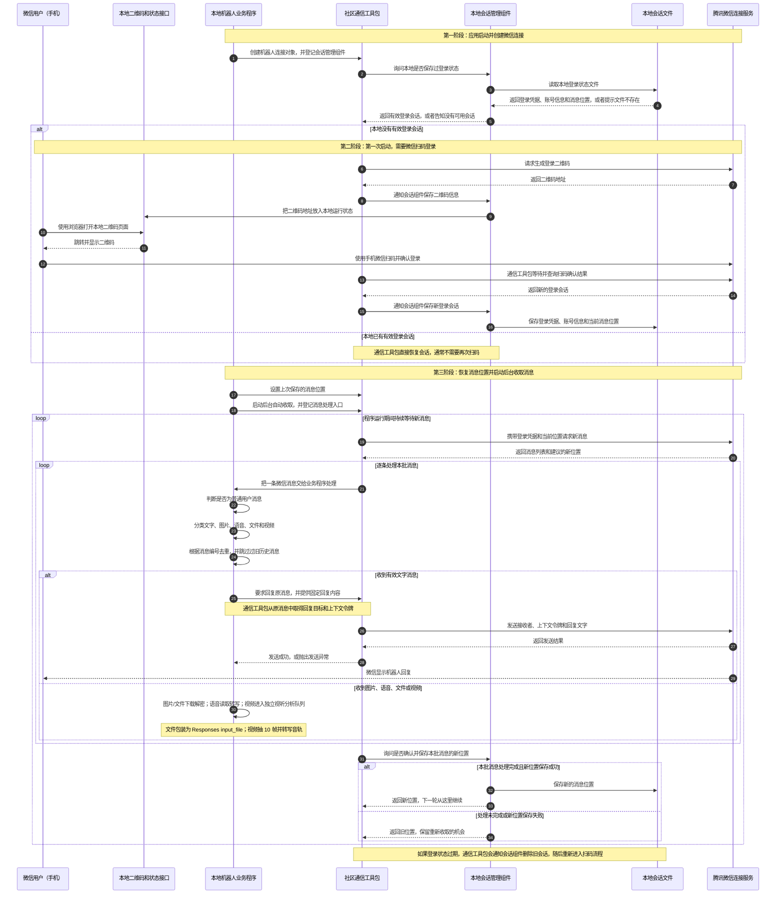

# iLink Java Demo 本地代码导读

这份文档不从 SDK 的底层源码讲起，而是从当前项目的一条真实消息如何流动开始。目标是让你知道：

1. 哪些代码是我们写的；
2. 哪些能力由 SDK 封装；
3. 想修改回复、图片或语音处理时应该改哪里；
4. 程序怎么启动、扫码和验证。

> 当前使用的 `io.github.morningwn:weixin-ilink-sdk:1.0.0` 是社区 Java SDK，不是腾讯官方发布的 Java 包。它连接的服务端地址是腾讯 iLink 服务。使用前应自行评估账号与合规风险，不要泄露本地会话文件。

## 一、先分清 JDK、Spring Boot、Maven 和 SDK

| 名称 | 在本项目中的作用 | 可以把它理解成 |
| --- | --- | --- |
| JDK 21 | 编译、运行 Java 代码 | Java 程序的发动机和工具箱 |
| Spring Boot | 管理对象、读取配置、启动 HTTP 服务 | 项目的应用框架 |
| Maven | 下载依赖、编译和运行测试 | Java 的依赖与构建工具 |
| iLink SDK | 封装登录、长轮询、协议对象和消息发送 | Java 与 iLink 服务之间的适配器 |
| 我们的业务代码 | 决定收到什么、回复什么、怎样记录状态 | 机器人自己的业务规则 |

SDK 不是另一个需要单独启动的程序。Maven 把它下载为一个 JAR，Spring 程序运行时直接调用 JAR 里的 Java 类。

## 二、整体通信链路



这里没有让微信安装一个 Java 插件。Java 程序通过 SDK 访问 iLink 服务；手机微信只负责扫码授权和正常收发消息。

## 三、推荐阅读顺序

### 1. `ILinkProperties`：配置从哪里来

文件：`src/main/java/com/example/ykdsummer/bot/config/ILinkProperties.java`

Spring Boot 把 `application.properties` 中的配置绑定到这个对象。最常用的配置是：

- `enabled`：是否启用 iLink；
- `baseUrl`：iLink 服务地址；
- `channelVersion`：SDK 通道版本；
- `fixedReply`：文字固定回复；
- `sessionFile`：登录凭据和消息游标的保存位置。

如果只想改变固定回复，不需要修改 SDK，只需要改配置：

```properties
ilink.fixed-reply=新的回复内容
```

也可以设置环境变量 `ILINK_FIXED_REPLY`。源码中的中文默认值使用 Unicode 转义，是为了避免 `.properties` 加载时再次出现乱码。

### 2. `ILinkRuntimeState`：程序现在是什么状态

文件：`src/main/java/com/example/ykdsummer/bot/runtime/ILinkRuntimeState.java`

这是一个本地状态板。它记录：

- 是否等待扫码或已经连接；
- 当前二维码地址；
- 已接收和已发送数量；
- 最近消息类型；
- 最近错误。

它不负责建立连接，也不会保存 token 和 contextToken。`/api/ilink/status` 返回的是这里的 `Snapshot`。

### 3. `ILinkSessionStore`：SDK 如何登录和记住进度

文件：`src/main/java/com/example/ykdsummer/bot/session/ILinkSessionStore.java`

这个类实现了 SDK 的 `SessionHandler`，所以它的主要方法由 SDK 自动调用：

| 回调 | 发生时机 | 本项目做什么 |
| --- | --- | --- |
| `loadSession()` | SDK 启动 | 从 `.ilink/session.properties` 恢复登录 |
| `onQrcode(...)` | 没有有效会话 | 保存二维码 URL，供浏览器打开 |
| `persistSession(...)` | 扫码成功或会话更新 | 保存 token 等会话字段 |
| `clearSession(...)` | 会话过期 | 删除文件，等待重新扫码 |
| `confirmGetUpdatesBuf(...)` | 一批消息处理结束 | 保存新的消息游标 |

“游标”可以理解成读书书签。SDK 拉到一批消息并成功交给业务处理后，游标向前移动。下次请求从新位置继续，重启后也不会从最早位置重读。

会话文件含登录 token。不要把它发给别人，不要放进文档，不要提交 Git。

### 4. `ILinkBotService.start()`：连接从哪里开始

文件：`src/main/java/com/example/ykdsummer/bot/service/ILinkBotService.java`

Spring 创建完对象后会自动执行 `@PostConstruct start()`：

```java
ILinkClientConfig clientConfig = ILinkClientConfig.builder()
        .baseUrl(settings.getBaseUrl())
        .channelVersion(settings.getChannelVersion())
        .build();

ILinkBot startedBot = new ILinkBot(clientConfig, "ykd-summer", sessionStore);
startedBot.setGetUpdatesBuf(sessionStore.loadCursor());
startedBot.startAutoPull(this::handleInboundMessage);
```

逐行理解：

1. `ILinkClientConfig` 告诉 SDK 请求哪个服务；
2. `new ILinkBot(...)` 创建 SDK 客户端，并注册会话回调；
3. `setGetUpdatesBuf(...)` 恢复消息书签；
4. `startAutoPull(...)` 让 SDK 启动后台长轮询；
5. `this::handleInboundMessage` 表示每来一条消息，就调用本类的这个方法。

我们没有自己写 HTTP 长轮询循环，是因为这部分已经由 SDK 封装。

### 5. `handleInboundMessage(...)`：收到消息后做什么

一条 `WeixinMessage` 是一层“消息信封”，里面的 `itemList` 是具体内容。一条消息可能包含一个或多个 item，不能永远假设只有文字。

当前处理顺序：

1. 只接受普通用户消息；
2. 把空 `itemList` 转为空列表
3. 把 SDK 整数类型转换为 `TEXT`、`IMAGE`、`VOICE` 等枚举；
4. 记录接收数量和最近类型；
5. 对非文字 item 记录日志；
6. 找到第一段非空文字；
7. 根据 messageId 去重；
8. 跳过程序启动前太久的历史消息；
9. 调用 SDK 的 `replyText(...)` 固定回复；
10. 记录发送结果，不让单条发送失败阻塞整个消息游标。

最重要的一行是：

```java
requireRunningBot().replyText(message, settings.getFixedReply());
```

这里的分工是：

- 本项目决定回复内容是 `fixedReply`；
- SDK 从入站 `message` 中使用发送者和 `contextToken`；
- SDK 组装并发送 `sendmessage` 请求。

### 6. `ILinkMessageType`：为什么还要做一层枚举

文件：`src/main/java/com/example/ykdsummer/bot/message/ILinkMessageType.java`

SDK/协议使用整数类型码。这个类把整数翻译为业务可读名称：

- `TEXT`：文字；
- `IMAGE`：图片；
- `VOICE`：语音；
- `FILE`：文件；
- `VIDEO`：视频；
- `UNKNOWN`：当前代码不认识的新类型。

保留 `UNKNOWN` 很重要：SDK 或服务端以后增加类型时，旧程序不会因为一个陌生整数直接崩溃。

### 7. `RecentMessageIds`：为什么同一条消息不会重复回

文件：`src/main/java/com/example/ykdsummer/bot/message/RecentMessageIds.java`

网络重试和游标提交失败都可能让一条消息再次到达。这个类在内存中保存最近 1000 个 messageId。

当前方案适合单机 Demo；重启后集合会清空，多实例也不共享。正式系统应使用 Redis/数据库做幂等。

### 8. `ILinkController`：浏览器接口只是操作入口

文件：`src/main/java/com/example/ykdsummer/bot/controller/ILinkController.java`

| 地址 | 用途 |
| --- | --- |
| `GET /api/ilink/status` | 查看连接、轮询、收发计数和错误 |
| `GET /api/ilink/qrcode` | 有待扫二维码时跳转；已登录返回 404 是正常的 |
| `POST /api/ilink/send` | 使用明确的 toUserId 与 contextToken 主动发送文字 |

Controller 没有实现 iLink 协议，只是调用 `ILinkBotService`。

## 四、图片、语音、文件和视频现在怎样处理

入口先由 `ILinkBotService.logNonTextItems(...)` 记录不含隐私内容的类型日志，再由
`ILinkReplyService` 决定真正的业务分支：

| 类型 | 当前行为 | 后续应做什么 |
| --- | --- | --- |
| 文字 | 合并全部文字；固定命令优先，其余交给大模型 | 可继续增加业务命令 |
| 语音 | 有微信转写文字时复用文字模型；无转写时固定提示 | 后续可增加独立 ASR |
| 图片 | SDK 下载并解密，转成 Data URL 交给视觉模型，同时登记为 `img_* v1`；后续纯文本可由模型查询、视觉识别、生成新版本或回退 | 当前一次最多 3 张；“修改”目前是根据描述重新生成，不是像素级修图 |
| 文件 | SDK 下载解密；文件登记为当前用户的 `doc_* v1`。正文可提取时模型通过 `DocumentTools` 自主分析、新建、修改或回退版本 | 一次 1 个、最大 20 MiB；输出支持 DOCX、XLSX、PDF、TXT，属于内容级重建；版本落盘可跨重启恢复 |
| 视频 | SDK 下载解密，FFmpeg 固定抽取 10 帧并提取音轨转写，交给视觉模型 | 当前最长 60 秒、最大 20 MiB |

完整视频实现请继续阅读 [ILINK_VIDEO_ANALYSIS_GUIDE.md](../features/ILINK_VIDEO_ANALYSIS_GUIDE.md)。

SDK 当前公开了 `sendImage`、`sendVoice`、`sendFile`、`sendVideo` 等发送方法，但“SDK 有方法”不等于业务已经实现。我们还需要决定：发给谁、使用哪个 contextToken、文件从哪里来、允许多大、失败如何重试。

## 五、启动、扫码和验证

### IntelliJ IDEA 启动

运行配置中的主类应为：

```text
com.example.ykdsummer.YkdSummerApplication
```

在 **Program arguments（程序实参）** 填写：

```text
--ilink.enabled=true
```

注意前面是两个减号。不要写成 `text--ilink.enabled=true`。

点击 IDEA 的运行按钮后，不需要再开 PowerShell启动第二次。看到 Tomcat 已启动且日志出现 iLink polling/二维码信息，说明同一个 Spring 进程已经同时启动了 Web 接口和 SDK。

### PowerShell 启动（二选一）

如果不用 IDEA，可在项目目录执行：

```powershell
mvn spring-boot:run "-Dspring-boot.run.arguments=--ilink.enabled=true"
```

IDEA 和 PowerShell 只选一种，否则两个进程可能争用 8080 端口和同一个会话文件。

### 第一次登录

1. 启动后打开 `http://127.0.0.1:8080/api/ilink/status`；
2. 状态为 `WAITING_FOR_QR_SCAN` 时打开 `http://127.0.0.1:8080/api/ilink/qrcode`；
3. 用手机微信扫码并确认；
4. 再看 status，状态应变为 `CONNECTED` 且 `polling=true`；
5. 会话会保存到 `.ilink/session.properties`，下次通常无需扫码。

想强制重新扫码，应先停止程序，再删除 `.ilink/session.properties`，然后重新启动。不要在程序写文件时删除。

### 收发验证

让另一个微信向已连接账号发送一条新文字。观察：

- IDEA 控制台出现收到消息和回复日志；
- 微信收到配置中的固定回复；
- `/api/ilink/status` 的 `receivedMessages`、`sentMessages` 增加；
- `lastError` 为空。

如果“已连接但不回复”，按顺序检查：

1. `enabled` 是否为 true；
2. `polling` 是否为 true；
3. 发的是启动后的新文字，不是过旧历史消息；
4. 日志是否显示重复消息或发送失败；
5. `lastError` 的具体内容；
6. 是否同时启动了两个 Java 进程。

## 六、最安全的修改顺序

初学阶段建议每次只改一层：

1. 先改 `fixedReply`，验证配置生效；
2. 再在 `handleInboundMessage` 中加入关键词分支；
3. 把文字处理抽成独立 `TextMessageHandler`；
4. 再增加语音转文字复用文字处理；
5. 最后处理图片下载、CDN/加密和视觉识别。

每次修改后运行：

```powershell
mvn test
```

先保证已有文字收发没有被破坏，再继续增加新类型。这样代码和 SDK 的职责不会混在一起。
