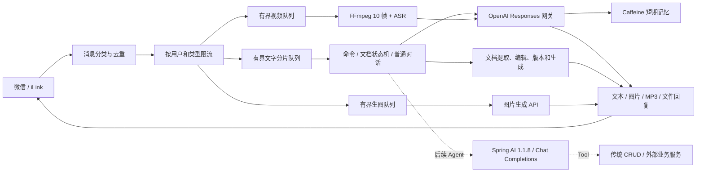

# 六分支审查与统一集成说明

## 2026-07-31 增量复审

本轮以已验证服装检查点 `3b05aff` 为基线，重新审查各成员在 2026-07-30 前后的最新提交。
最终汇总目标仍是既有 `codex/ilink-integration`，不新增第二条合入 `master` 的路径。

| 分支 | 最新提交 | 新增优点 | 当前架构对照 | 结论 |
|---|---|---|---|---|
| `feature/rag` | `89d6227` | 每日、每周周期提醒 | 当前 MySQL Reminder 已支持 ONCE/DAILY/WEEKLY、重启恢复和到点唤醒 Agent | 已覆盖，不移植重复 Cron 调度器 |
| `ilink-lwb` | `39e2206` | 有界图片队列、Tool Trace、异步图片主动回传测试、Agent 循环 | 当前基线已经包含这些能力；Tool Trace 还增加耗时/成功率，Agent 使用 Spring AI 官方链路按 4 个规划轮次限流 | 保留当前增强版；不合 SQLite、通用 Skill、娱乐工具和运行时数据 |
| `wgy` | `8450511` | Skill 路由、MyBatis 调度和会话表、微信回复改造 | 与当前 MySQL/Flyway/JDBC 和 Agent Tool 编排重复；其移除请求 `contextToken` 会削弱后台主动回传 | 不移植；图片数据也不进入代码仓库 |
| `zx` | `78717fe` | 线程池优雅停机、出站文本去重、文件型提醒和画像 | 入站已按 messageId 本地+Redis 去重；提醒和画像已有用户隔离的 MySQL 领域模型 | 采用优雅停机思想并重写；拒绝文本哈希去重和文件型业务存储 |
| `zxm` | `3ccc472` | 有界图片执行器、异步测试、Tool Registry smoke test | 已被当前基线吸收并增强 | 不覆盖当前配置，不恢复泛用工具 |
| `tjy-wechatbot-init` | `2a428ce` | 文件自然语言交互、队列、配置模板 | 已通过早期集成进入当前祖先 | 保留既有成果；飞书继续从服装 Agent 下线 |

本轮实际新增的是 `GracefulExecutorShutdown`：它借鉴 `zx` 的关闭治理，但按当前 Spring 生命周期重写。
所有线程池先停止接单，在一个共享截止时间内排空已接受任务，只有超时任务才被强制中断。没有照搬额外
JVM shutdown hook，也没有让多个线程池分别消耗完整的 30 秒超时。

出站文本不按“用户 + 文案”做短时去重。相同文字可能来自两次合法请求或两个独立后台任务；正确边界是
入站 messageId、提醒 deliveryId、图片 taskId 和推荐 optionId 的业务幂等状态。

汇总路径保持唯一：

```text
各成员分支增量审查
  -> 选择性移植到当前已验证检查点
  -> fast-forward 既有 codex/ilink-integration
  -> 全量测试与人工验收
  -> 后续单一 Merge Request 到 master
```

## 1. 结论

六个分支不能按顺序直接合并。它们都在实现微信 iLink + AI + 文件/媒体能力，类名、路由和配置大量重复，并且部分分支不是从同一个 `master` 提交点继续开发。连续 merge 会把六套路由、六套上下文和多套 AI 协议同时带入项目，冲突解决后也很难判断运行时到底走哪一套。

统一分支采用以下策略：

1. 从受保护的 `master` 建立 `codex/ilink-integration`。
2. fast-forward 到测试最完整的 `wangentong`，将它作为业务基线。
3. 逐项审查其他分支，只迁移经过验证且确实更好的设计。
4. 不直接向 `master` 推送，最终只提交一个合并请求。

统一技术栈为：

| 组件 | 统一版本 |
|---|---:|
| JDK | 21 |
| Spring Boot | 3.5.16 |
| Spring AI | 1.1.8 |
| Maven | 3.9.x |

## 2. 六分支实测结果

| 分支 | 相对 master | 主类 / 测试类 | 实际构建 | 综合评价 |
|---|---:|---:|---|---:|
| `wangentong` | 领先 6 | 53 / 31 | 94 项测试通过，8 个 Live 探针跳过 | 88 / 100 |
| `tjy-wechatbot-init` | 落后 1、领先 2 | 52 / 0 | 编译成功，无自动化测试 | 60 / 100 |
| `zxm` | 领先 12 | 19 / 0 | 离线编译成功，无自动化测试 | 52 / 100 |
| `ilink-lwb` | 落后 1、领先 3 | 14 / 0 | 编译成功，无自动化测试 | 38 / 100 |
| `wgy` | 落后 1、领先 19 | 19 / 0 | 编译失败 | 25 / 100 |
| `zx` | 落后 1、领先 8 | 1 / 1 | POM 无法建立项目模型 | 5 / 100 |

评分不是按代码行数计算，而是综合功能闭环、并发与资源边界、安全、可维护性、测试和仓库卫生。

## 3. 功能矩阵

| 能力 | wangentong | tjy | zxm | ilink-lwb | wgy | zx |
|---|---|---|---|---|---|---|
| iLink Session/Cursor | 完整且有测试 | 有 | 有 | 仅 Session | 有 | 无 |
| 多轮上下文 | 有，按用户加锁 | Caffeine，有上限 | 内存 ArrayList | JSON 文件 | 内存 ArrayList | 无 |
| OpenAI Responses | 有 | 无 | 无 | 无 | 无 | 无 |
| Spring AI | 原分支无 | 无 | 1.0.0 | 无 | 无 | 无 |
| 图片理解/生成 | 有 | 有 | 有 | 图片理解 | 有 | 无 |
| 视频抽帧 + ASR | 有，10 帧联合理解 | 有路由 | 无 | 仅上传整段 | 无 | 无 |
| MP3 语音回复/换音色 | 有，只回 MP3 | 同时回文本和语音 | 有 | 同时回文本和语音 | 有 | 无 |
| 文件识别 | 11 类 Responses + 本地提取 | 本地解析 | Tika | DOC/DOCX/PDF | 有 | 无 |
| 文档修改/版本/撤销 | 完整 | 无 | 无 | 无 | 无 | 无 |
| 多格式新文件生成 | Word/PDF/PPT/Excel/TXT 等 | TXT/DOC/DOCX/XLSX/PDF | 7 类 | DOCX/PDF | 4 类 | 无 |
| 有界执行队列 | 视频有界 | 统一有界 | 部分异步无界 | 无 | 无 | 无 |
| 按类型限流 | 原分支无 | 有 | 无 | 无 | 无 | 无 |
| 自动化测试 | 94 项 | 0 | 0 | 0 | 0 | 0 |

## 4. 选入总分支的能力

### 4.1 保留 `wangentong` 的通用基础设施

保留已经真实验证的能力：

- iLink 扫码登录、Session 与 Cursor；
- Responses 普通对话和短期上下文；
- 图片生成、图片理解；
- 视频 10 帧、音轨 ASR、视听联合理解；
- 阿里云 MP3 TTS 和按用户动态音色；
- 文件输入与显式 MIME 映射；
- 通用文件下载、正文提取和 DOCX/XLSX/PDF/TXT 渲染；
- Spring AI Chat Completions 与 Responses 双协议路由。

### 4.2 复刻 `tjy` 的文件交互

按当前架构复刻其关键流程：

- Caffeine 会话缓存：最大用户数、访问过期、自动淘汰；
- 文件缓存 5 分钟，下一条自然语言与正文组合处理；
- 模型用内部 `FILE_GEN||JSON` 选择普通回答或生成 DOCX/XLSX/PDF/TXT；
- 用户不需要记忆文件生成前缀或文档模式命令；
- 有界文字队列和生图队列：外部模型变慢时不再无限占用内存；
- 按用户 + 消息类型的滑动窗口限流；
- Actuator 健康检查。

已移除 `wangentong` 的文档状态机、版本、撤销和最近文档模式，避免两套文件路由同时存在。

### 4.3 从 `zxm` 吸收 Spring AI 方向

总分支引入 Spring AI 1.1.8 OpenAI Starter，作为后续 Chat Completions、Agent 和 Tool 的入口。

Spring AI 与 Responses 网关并存：

- Agent/Tool：后续走 Spring AI + Chat Completions；
- 文件、图片和已经验证的多模态能力：继续走 OpenAI Java SDK Responses；
- 两条协议通过业务接口隔离，不互相覆盖。

### 4.4 构建约束

Maven Enforcer 明确要求：

- Java `[21, 22)`；
- Maven `[3.9, 4)`。

不满足技术基线时会在构建开始阶段直接失败，避免开发机版本不同导致隐蔽问题。

## 5. 明确不合入的实现

### `zxm`

- 通过反射访问 SDK 私有客户端；
- API Key 前缀日志；
- WebSocket 任意 Origin 和静态全局 Session；
- 未同步 `ArrayList` 上下文；
- PDF 长行截断、HTML 未转义；
- 仓库中的运行日志和请求探针 JSON。

### `tjy-wechatbot-init`

- 关键词才能触发文件会话的逻辑，会漏掉“第二段改掉”等自然要求；
- 两层重复去重；
- 临时文件消费后可能无法清理；
- 对 4xx 也重试并记录完整响应；
- 成功发送 MP3 后仍额外发送文本；
- `.idea` 和疑似固定凭据 `git-askpass.bat`。

### `ilink-lwb`

- `userId + .json` 直接拼接路径；
- 非原子明文历史文件与非同步列表；
- PDF 多页流关闭和内容截断问题；
- 一次性文件分析，没有文档版本状态机。

### `wgy`

- 当前提交无法编译；
- 自建 `com.fasterxml.jackson.annotation` 补丁类污染第三方命名空间；
- 本地 JAR 和 IDE 文件被跟踪；
- CSV 通过普通逗号切分；
- 无自动化测试。

### `zx`

- POM 缺少 Spring Boot 版本管理；
- 只有占位主类，没有独立业务能力。

## 6. 统一后的架构



## 7. 记忆与后续 Redis/数据库方案

当前 Caffeine 只负责单实例短期记忆：进程重启后普通聊天记录会清空。文档版本仍按现有逻辑保存到本机 `.documents`，不会把二进制文件塞进对话历史。

生产阶段建议把记忆拆成三层：

1. Caffeine：当前活跃请求的热缓存；
2. Redis：最近若干轮对话、文档会话状态、幂等键和短期任务状态；
3. MySQL/PostgreSQL：会话索引、消息摘要、文件元数据、审计与用户明确要求保留的历史。

二进制文件放对象存储，只在数据库记录文件 ID、版本、SHA-256、MIME、大小和权限，不把 Base64 长期写入 Redis 或关系库。

## 8. 验证命令

```powershell
java -version
mvn -version
mvn test
mvn package -DskipTests
```

合并路径保持唯一：

```text
codex/ilink-integration -> master
```

不要再把其他五个分支逐个 merge 到总分支。后续某个分支还有新提交时，应按“单个提交/单个类/单项设计”审查后选择性移植，并补自动化测试。
