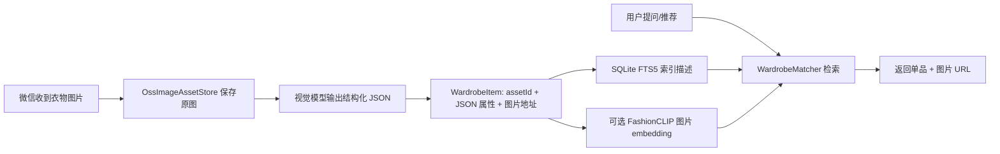

# 本地衣柜：图片 + JSON 结合的 RAG 设计

- **日期**: 2026-07-31
- **状态**: 设计草案
- **目标**: 用户通过微信存入衣物图片后，视觉模型产出细致描述，结构化属性与图片引用进入 RAG，推荐/搭配时按用户需求召回已有单品并展示图片。

---

## 1. 核心结论

推荐采用 **“图片二进制进 OSS/本地资产库，结构化描述 + 图片地址进 RAG”** 的路线，这也是工业界主流做法。

所谓“图片进 RAG”，实际指图片 embedding 与文本/JSON embedding 一起进入向量库，而不是把图片字节塞进检索数据库。图片字节最终仍应放在对象存储（OSS）或本地资产库，RAG 中保存图片地址与检索内容。

---

## 2. 现有参考项目

| 项目 | 说明 | 参考价值 |
|------|------|----------|
| [Fashionpedia](https://github.com/cvdfoundation/fashionpedia) | 服装属性知识体系，含类别、颜色、纹理、袖型、领型等细粒度属性 | 设计视觉模型输出的结构化 JSON 字段 |
| [FashionCLIP](https://github.com/patrickjohncyh/fashion-clip) | 服装领域文本-图片 embedding 模型 | “按描述找衣服”“找相似单品”的图片语义检索 |
| [multimodal-rag-fashion-search](https://github.com/sumitghugare/multimodal-rag-fashion-search) | CLIP + FAISS + LLM，图片 embedding 和文本描述一起进向量库后做 RAG 推荐 | 最接近“图片和信息都进 RAG”的路线 |
| [fashion-retrieval-system](https://github.com/rajveer100704/fashion-retrieval-system) | FashionCLIP + FAISS + 元数据重排 | 图片向量检索后用 JSON 属性二次筛选的混合检索 |
| [Wardrobe_Recommendation_Engine](https://github.com/pratim4dasude/Wardrobe_Recommendation_Engine) | Agentic AI 造型师，多模态检索 + 混合召回 | 方向最接近“微信衣柜 + 穿搭推荐” |
| [RAGFlow](https://github.com/infiniflow/ragflow) | 图片可作为知识库 chunk，文档解析 + embedding + 混合检索 + rerank | 直接作为多模态 RAG 底座 |
| [Dify](https://github.com/langgenius/dify) | 知识库支持图片文档块，检索返回内容同时带回图片引用 | “元数据 + 图片地址”路线的成熟例子 |

---

## 3. 两种方案对比

| 维度 | A. 图片 + JSON 都进 RAG | B. JSON/描述进 RAG，图片进 OSS |
|------|------------------------|--------------------------------|
| 检索方式 | 图片 embedding + 文本 embedding 同一向量空间 | 文本/JSON 检索为主，图片 embedding 可选 |
| 存储成本 | 向量库存 embedding 和文件引用，图片字节仍需单独存 | 图片二进制放 OSS，向量库只存轻量描述 |
| 微信回复展示 | 需要额外拼接图片 URL | 直接返回 OSS 签名 URL / assetId |
| 图片版本管理 | 一般只存一个版本 | 适合多版本、回溯、换衣历史 |
| 隐私/权限 | 图片进第三方 RAG 服务风险更高 | OSS 私有桶 + 签名 URL 可控 |
| 工程复杂度 | 高，需要维护多模态 embedding 管道 | 低，先做 FTS/JSON 即可上线 |

**注意**：即使选择方案 A，图片字节最后也还是放在对象存储；RAG/向量库中保存的是图片 embedding 和图片地址，不存在“图片二进制直接塞进 RAG 数据库”的做法。

---

## 4. 落地设计

### 4.1 推荐流程



### 4.2 WardrobeItem 数据结构

视觉模型输出的结构化 JSON 建议参考 Fashionpedia 的字段风格：

```json
{
  "assetId": "img_xxxxxxxxxxxx",
  "imageUrl": "https://oss-bucket/ilink-bot/images/xxx/v1.png",
  "category": "T_SHIRT",
  "color": ["white", "blue"],
  "pattern": "SOLID",
  "material": "cotton",
  "fit": "REGULAR",
  "season": ["SUMMER", "SPRING"],
  "occasion": ["DAILY", "CASUAL"],
  "styleTags": ["minimal", "casual"],
  "detailedDescription": "白色宽松圆领短袖 T 恤，纯棉材质，胸前有小 logo，适合日常通勤。"
}
```

SQLite 建议结构：

```sql
CREATE TABLE IF NOT EXISTS wardrobe_items (
    user_id       TEXT NOT NULL,
    asset_id      TEXT NOT NULL,
    image_url     TEXT NOT NULL DEFAULT '',
    attributes    TEXT NOT NULL,      -- 视觉模型输出的结构化 JSON
    description   TEXT NOT NULL DEFAULT '',
    created_at    TEXT NOT NULL DEFAULT (datetime('now','localtime')),
    updated_at    TEXT NOT NULL DEFAULT (datetime('now','localtime')),
    PRIMARY KEY (user_id, asset_id)
);

CREATE INDEX IF NOT EXISTS idx_wardrobe_user_created
    ON wardrobe_items(user_id, created_at);
```

`description` 由 `detailedDescription` + 标签字段拼接而成，用于 FTS5 检索；`attributes` 保留完整 JSON 供精确过滤和后续扩展。

### 4.3 检索策略

1. **文本检索（首期）**：`description` 进入 FTS5，复用现有 `FashionKnowledgeService` 的 BM25 双路召回思路，支持“白色”“通勤”“夏天”等查询。
2. **属性过滤（首期）**：用户需求经 `QueryAnalyzer` 提取场景/季节/风格后，先用 JSON 属性做结构化过滤，再按 FTS 分数排序。
3. **图片语义检索（二期）**：接入 FashionCLIP 生成图片 embedding，支持“找一件类似的上衣”“和这件裙子搭配”等需要视觉相似度的场景。

---

## 5. 与现有代码的衔接

| 现有组件 | 复用方式 |
|----------|----------|
| `OssImageAssetStore` | 保存衣物原图、版本、签名 URL，替换 `annotate()` 的文本摘要为结构化 JSON |
| `LocalImageAssetStore` | 本地开发回退，生产切 OSS |
| `ImageInspectionService` / `DashScopeVisionService` | 视觉模型入口，扩展为“结构化 JSON 抽取” |
| `FashionKnowledgeService` | FTS5 检索实现可复用到 wardrobe 表 |
| `fashion-master-plan.md` 中的 `WardrobeService` | 落成实际服务，负责入库、检索、匹配 |
| `RetrievedChunk` / Agent 管道 | 把单品描述注入 Stylist/Coordinator，并携带图片 URL |

---

## 6. 分阶段实现

### Phase 1: 衣物图片入库（基础版）

- 新增 `WardrobeItem` 数据模型与 `wardrobe_items` 表。
- 微信收到图片 → 保存到 `OssImageAssetStore` → 视觉模型输出结构化 JSON → 写入 SQLite。
- `description` 建立 FTS5 索引。

### Phase 2: 检索与匹配

- 新增 `WardrobeService`：按用户查询召回单品。
- 新增 `WardrobeMatcher`：FTS + 属性过滤 + 简单打分。
- 接入 `fashion_consultant` 管道，推荐时优先匹配用户已有单品。

### Phase 3: 图片语义检索（可选）

- 接入 FashionCLIP 或等价图片 embedding 模型。
- 新增图片向量表或向量列，支持“找类似单品”。

---

## 7. 风险与注意点

- 视觉模型输出必须固定 JSON Schema，避免自由文本导致检索质量不稳定；入库前做一次字段校验。
- 图片 URL 应使用 OSS 私有桶 + 签名 URL，微信端展示时再生成短期地址。
- FTS5 对中文短词召回有限，保留现有“MATCH + LIKE 兜底”的双路策略。
- 先做文本/JSON 检索，再上图片 embedding；不要一开始就引入完整多模态向量库。
